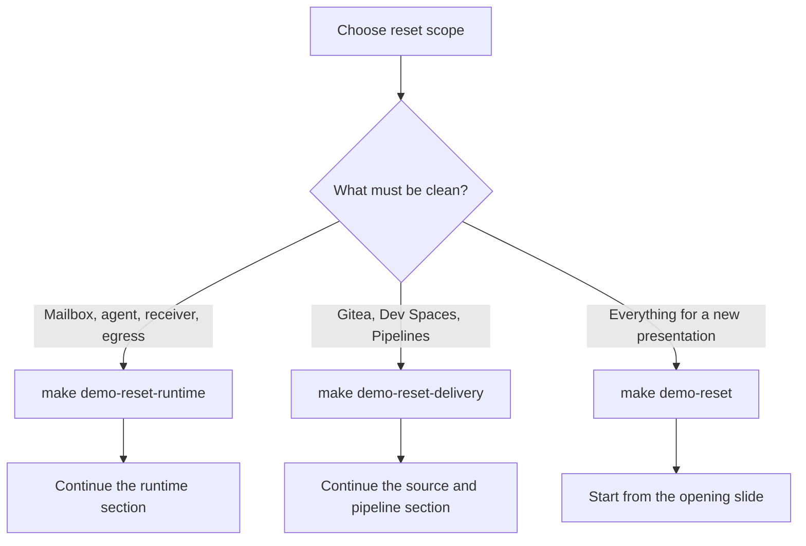

# Demo reset contract

The reset commands prepare a presentation state. They do not reinstall RHACS, erase Scanner data, delete application PVCs, or rebuild the RHACS vulnerability database.

## Full presentation reset

Run `make demo-reset`. The order is deliberate:

1. Delete every old PipelineRun and TaskRun and wait until they are gone.
2. Delete the corresponding Tekton Results rows so the Console has no archived history.
3. Remove the Gitea webhook and the two custom release gates.
4. Resolve runtime alerts attached to the previous workload identities.
5. Delete all application Deployments, then recreate the affected OpenClaw workload through the original OpenShift build path.
6. Restore the mailbox, agent state, empty receiver, and permissive egress state.
7. Recreate RHACS registry integration, base-image ownership, platform classification, custom policies, and locked process/network baselines.
8. Recreate Gitea with one signed affected-version commit while no webhook exists.
9. Recreate the webhook and Dev Spaces. The workspace uses the operator-provided terminal, namespace-scoped RBAC, RHACS credentials from a Secret, and the prebuilt workstation tools.
10. Create one rejected v1 PipelineRun and one successful, signed v2 PipelineRun. Neither run deploys an image.
11. Enable RHACS deployment-create admission, then assert two Kubernetes PipelineRuns, two Tekton Results entries, clean receiver/mailbox/egress state, and no unexpected active RHACS alerts.

The expected opening state contains exactly two pipeline runs. The failed v1 run reports the affected OpenClaw version and missing approved signature. The successful v2 run contains the maintained component, final-image SBOM, signature, RHACS checks, and deployment check. Its promotion task is deliberately skipped. The running workload remains v1 until the presenter runs `make promote-v2`.

## Runtime-only reset

Run `make demo-reset-runtime` between runtime rehearsals. It restores two normal messages, removes OpenClaw sessions and provider caches, clears receiver evidence, removes sender Jobs, restores permissive egress, and resolves runtime alerts. It does not touch Gitea, Pipelines, Dev Spaces, images, policies, or baselines.

## Delivery-only reset

Run `make demo-reset-delivery` between delivery rehearsals. It deletes all PipelineRuns, TaskRuns, and archived Results; temporarily removes the webhook; recreates Gitea and Dev Spaces; restores the webhook; and stages the rejected v1 and approved v2 runs. It reuses the tested workstation image and does not reinstall RHACS.

## What “clean” means

| Surface | Full reset | Runtime reset | Delivery reset |
|---|---:|---:|---:|
| Two normal emails only | Yes | Yes | No change |
| No OpenClaw sessions | Yes | Yes | No change |
| Empty receiver | Yes | Yes | No change |
| Permissive egress | Yes | Yes | No change |
| One affected Gitea commit | Yes | No change | Yes |
| One intentional failed PipelineRun | Yes | No change | Yes |
| No old Tekton archives | Yes | No change | Yes |
| Fresh application deployment identities | Yes | No | No |
| Rebuilt RHACS baselines | Yes | No | No |
