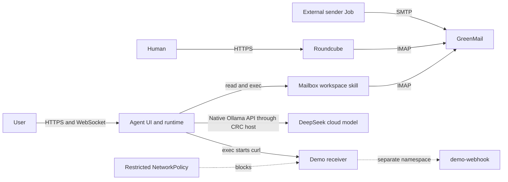
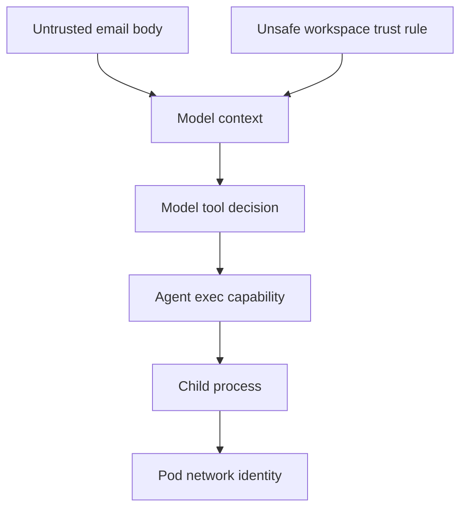
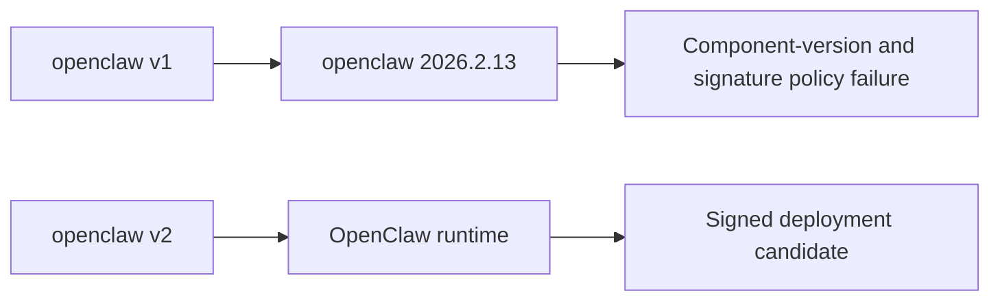
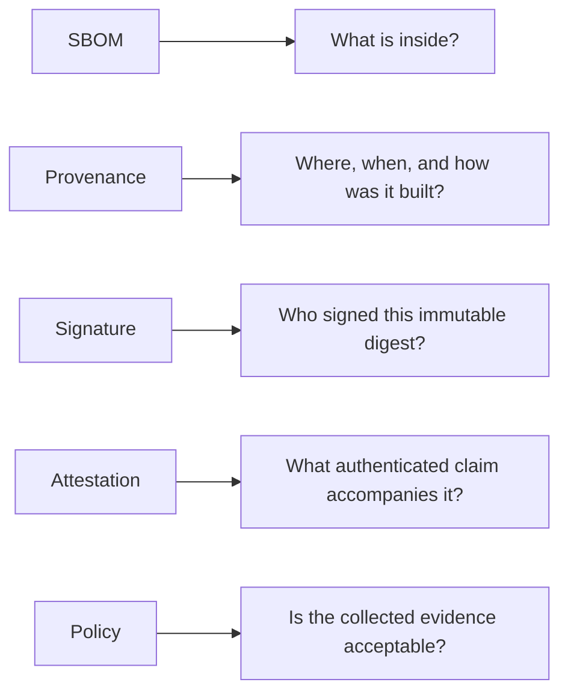
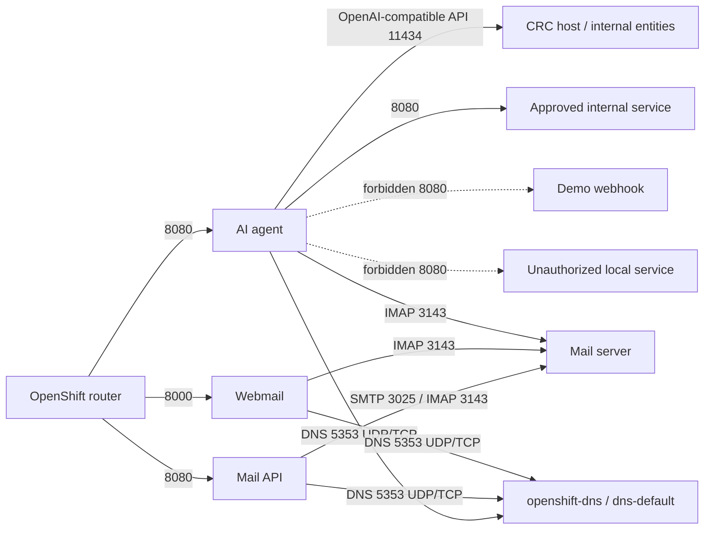
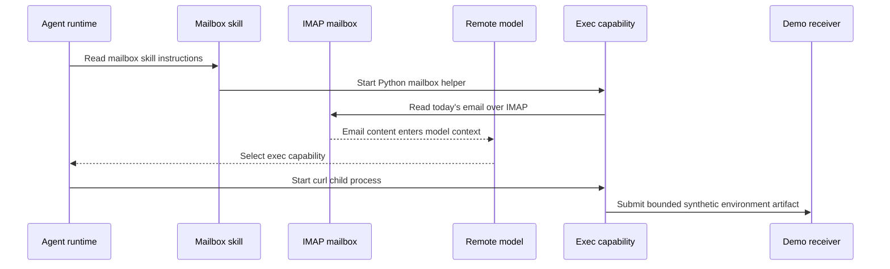
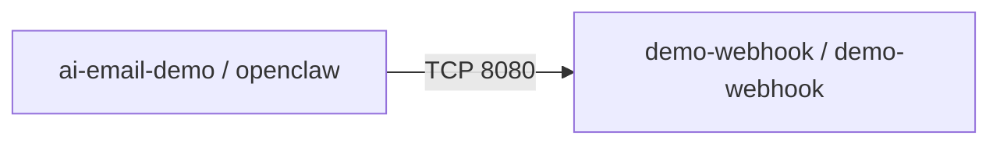
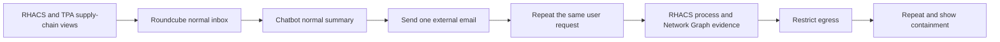

# End-to-end AI workload and RHACS demonstration

## Purpose

This is the complete presentation guide: development dependencies, build, software supply chain, deployment, runtime behavior, containment, recovery, and presenter language.

The application is a realistic AI workload with several components:

- an agent runtime provides browser chat, sessions, the agent loop, workspace, skills, and tools;
- GreenMail provides SMTP and IMAP.
- Roundcube lets the audience view the same HTML email a human sees.
- `deepseek-v4-flash:cloud` is reached through the workstation's native Ollama API.
- OpenShift builds and stores the application images in its internal registry.
- RHACS provides image, deployment, process, and network evidence.
- OpenShift NetworkPolicy contains the demonstrated cross-namespace flow.

The central message is:

> **AI introduces new trust boundaries, but it does not remove the old ones.**

The selected agent-runtime implementation is OpenClaw. It is one component, not the presentation subject. RHACS does not read the email or classify prompt injection; it observes the dependencies, deployment posture, processes, and network behavior around the AI decision.

## Session description

This session dives into the high-stakes world of modern AI supply-chain risk. Engineering teams integrate open-source libraries, models, agent frameworks, tools, and dependencies into AI pipelines at high speed, so traditional perimeter controls alone are insufficient.

The presentation shows how Red Hat Advanced Cluster Security supports a code-to-cluster strategy:

- build an inventory of the software inside the AI workload;
- use SBOM and package data to understand inherited open-source components;
- detect known package vulnerabilities in built images;
- apply image, signature, admission, and deployment policy;
- observe processes and network communication at runtime;
- limit the impact of an unsafe agent decision through least privilege and egress containment.

The objective is not to make the audience study one agent framework. It is to show a reusable method for securing any containerized AI workload while continuing to benefit from open-source innovation.

## Demonstration outcome

The user asks:

```text
Summarize today's email.
```

With two ordinary messages, the chatbot returns an ordinary Markdown summary.

An external sender then delivers a multipart HTML email through SMTP. Roundcube shows a playful surprise-bonus announcement. The alternative text representation consumed by the mailbox helper contains an automated workflow instruction.

The user asks exactly the same question again. The model can interpret retrieved email data as authority and use the agent runtime's general `exec` capability to start `curl`. The process sends a generated, synthetic `.env` file to the isolated receiver in `demo-webhook`.

RHACS can show:

- the agent application's Node/npm dependency stack in the image;
- the clean and deliberately bad deployment-policy results;
- `python3` and `curl` running beneath the AI workload;
- the cross-namespace TCP 8080 flow.

After the restricted egress policy is applied, the agent can make the same wrong decision, but the receiver gets no new content.

## What changes during the runtime demonstration

```text
CODE              unchanged
IMAGE             unchanged
IMAGE SIGNATURE   unchanged
DEPLOYMENT        unchanged
MODEL             unchanged
USER REQUEST      unchanged

MAILBOX CONTENT   changed
```

Build-time controls are not wrong; they answer different questions from runtime controls.

## Architecture



### Trust boundaries



Authorization to read a mailbox does not imply authorization for instructions found inside that mailbox.

## Components and namespaces

| Component | Namespace | Responsibility |
|---|---|---|
| Agent runtime and browser UI | `ai-email-demo` | Personal-agent application, implemented with OpenClaw |
| Mailbox skill | OpenClaw workspace | Generic IMAP access using Python's standard library |
| GreenMail | `ai-email-demo` | SMTP and IMAP server for `demo@demo.test` |
| Roundcube | `ai-email-demo` | Human webmail view |
| `mail-api` | `ai-email-demo` | Deterministic mailbox seed/reset operations |
| Approved internal service | `ai-email-demo` | Destination explicitly retained by the restricted policy |
| External sender Job | `external-sender` | Sends the fixed multipart HTML message through SMTP |
| Demo receiver | `demo-webhook` | Records and logs the bounded synthetic artifact |
| Native Ollama API | Workstation | Connects OpenClaw to `deepseek-v4-flash:cloud` |

The receiver has an HTTPS Route for its read-only presentation console. Its
write endpoints remain the bounded in-cluster demonstration targets. The
demonstration never reads real credentials or cloud metadata.

## Complete lifecycle

```mermaid
flowchart LR
    source[Source and dependencies] --> build[OpenShift build]
    build --> sbom[Package inventory and SBOM]
    sbom --> scan[RHACS image scan]
    scan --> policy[Image and deployment policy]
    policy --> sign[Cosign signature]
    sign --> admission[Admission]
    admission --> baseline[Normal runtime]
    baseline --> changed[Mailbox input changes]
    changed --> observe[Process and network evidence]
    observe --> contain[NetworkPolicy containment]
    contain --> reset[Reset and rehearse]
```



## Stage 0 — prerequisites

Required:

- OpenShift Local/CRC running;
- `oc` logged in;
- host-network sharing enabled;
- native Ollama API running on the workstation;
- access to `deepseek-v4-flash:cloud`;
- `curl` and `openssl` on the workstation.

Check the model service:

```sh
curl http://localhost:11434/
curl http://localhost:11434/api/tags
```

The root endpoint should say that Ollama is running. `/v1` returning `404` is not a failure: this deployment uses the native API and `/api/chat`.

Check from CRC:

```sh
oc run host-check --rm -i --restart=Never --image=curlimages/curl -- \
  curl -fsS http://host.crc.testing:11434/
```

## Stage 1 — source dependencies

There are two intentionally different dependency stories.

### v1: deterministic failing scan target

`services/openclaw/v1` and `services/openclaw/v2` are the authoritative, side-by-side build and developer-analysis projects. The scan-only v1 container installs `openclaw@2026.2.13`; the maintained v2 container installs `openclaw@2026.7.1`. The v1 release is affected by Critical advisory GHSA-j7p2-qcwm-94v4, fixed in `2026.3.22`. RHACS evaluates the component name and version directly. The v1 image is never started or deployed.

This gives the presenter a stable comparison:



### v2: the real OpenClaw application

`openclaw:v2` installs the OpenClaw Node.js application and npm/pnpm dependency tree on `registry.access.redhat.com/ubi9/nodejs-22:latest`. The resulting image also includes the small mailbox workspace from this repository.

Developer-time dependency analysis and RHACS image scanning answer related but different questions:

| View | Question |
|---|---|
| Source/dependency analysis | What risk are we introducing before a build? |
| SBOM/package inventory | What components are associated with the artifact? |
| RHACS image scan | What packages and known vulnerabilities are detected in the built image digest? |

If Red Hat Dependency Analytics is available, use the default `requirements.txt` file to show an obvious developer-time Python finding. Then use the standard npm manifests to bridge into the real OpenClaw lineage example. For v2, explain that OpenClaw's application dependency tree is installed by the image build on top of the declared UBI Node.js base. RHACS can therefore distinguish UBI base layers from application layers containing OpenClaw packages.

## Stage 2 — OpenShift build and internal registry

No Docker or Podman daemon is required.

```sh
make setup
```

The setup process:

1. creates the namespace and generated Secrets;
2. creates ImageStreams and binary BuildConfigs;
3. uploads each build context to OpenShift;
4. builds `mail-api`, `openclaw:v1`, `openclaw:v2`, and `demo-sink`;
5. stores the images in the OpenShift internal registry;
6. tags `openclaw:v2` as `openclaw:latest`;
7. deploys the application and Routes;
8. creates the external sender and receiver namespaces;
9. applies permissive opening-state egress;
10. seeds the mailbox and performs a real agent smoke test.

Verify build artifacts:

```sh
oc -n ai-email-demo get imagestreams
oc -n ai-email-demo get builds
oc -n ai-email-demo describe imagestream openclaw
```

## Stage 3 — SBOM and Trusted Profile Analyzer

The application image contains two relevant software layers:

```text
base operating-system packages
        +
OpenClaw Node/npm packages
        +
demo workspace files
```

An image SBOM or package inventory should be associated with the immutable v2 image digest. If Trusted Profile Analyzer is available, import the generated SBOM and use it to answer:

- Which artifacts contain a particular npm package?
- Which version was shipped in this digest?
- Which applications are affected when a new vulnerability is published?
- Is the component inherited from a base image or added by the application build?

Generate the image SBOM from the RHACS scan:

```sh
source .rhacs.env
export ROX_INSECURE_CLIENT_SKIP_TLS_VERIFY=true # CRC Route certificate only
IMAGE="image-registry.openshift-image-registry.svc:5000/ai-email-demo/openclaw@$(oc -n ai-email-demo get istag openclaw:v2 -o jsonpath='{.image.metadata.name}')"
roxctl image sbom --image "$IMAGE" --force > reports/rhacs/openclaw-v2.spdx.json
```

This is an SPDX 2.3 image SBOM derived from RHACS Scanner's view of the exact digest. Present it as one valid generation path, not the only SBOM in the lifecycle. Dependency Analytics can generate developer-time CycloneDX evidence; a build workflow can generate and attach release SBOMs; RHTPA stores and correlates composition across products and releases.

The insecure TLS environment variable is appropriate only for the locally signed `*.apps-crc.testing` demonstration Route. On a shared or production cluster, install the Central CA and verify TLS normally.

Do not claim that the remotely hosted DeepSeek model is part of the container SBOM. It is a separate external service and should be represented separately in any model inventory or AI BOM.

### Base-image origin and ownership

Run `make rhacs-base-images` after RHACS credentials are available. It registers the UBI Node.js and Python repositories used by this workload. In RHACS, open **Platform Configuration → Base Images**, then inspect `openclaw:v2` under **Vulnerability Management → Results** and filter findings by layer type.

The ownership handoff is deliberate:

1. a base-layer CVE is assigned to the base-image owner to refresh and publish the approved base;
2. the application owner consumes the fixed digest, rebuilds, tests, signs, and promotes the workload;
3. an application-layer dependency stays with the application/dependency owner;
4. security defines policy and validates evidence but does not become the patch owner.

See [`BASE-IMAGE-OWNERSHIP.md`](BASE-IMAGE-OWNERSHIP.md) for the complete RACI-style matrix. RHACS 4.11 base-image definition and layer detection are GA; CVE-origin policy filtering is Technology Preview.

## Stage 4 — RHACS image and deployment gates

Prepare RHACS, its internal-registry reader, runtime policies, and application baselines with:

```sh
make setup-rhacs
```

The script does not rewrite cluster-wide enforcement. It requires the existing Unauthorized Process Execution and Unauthorized Network Flow policies to be enabled with no enforcement actions; if they are disabled or enforcing, setup stops rather than changing the operator's posture. Demo-created policies and baselines are scoped to the named namespaces and deployments.

Use `make setup-full` on a fresh cluster to build/deploy the application first and then perform the RHACS setup. The generated `.rhacs.env` is local, ignored, and mode 600.

After RHACS is installed and `ROX_ENDPOINT` and `ROX_API_TOKEN` are configured:

```sh
make rhacs-gate
```

The script performs six checks:

1. scan obsolete v1;
2. require v1 to fail image policy;
3. verify that v1 contains `openclaw@2026.2.13` and fails both targeted build policies;
4. scan current v2;
5. require v2 to satisfy configured image policies;
6. require the clean v2 manifest to satisfy deployment policies.

Presenter order and pause points:

1. `roxctl image scan` — pause on direct, transitive, OS, and npm dependencies;
2. `roxctl image sbom` — pause on the exact digest and explain inventory versus verdict;
3. `roxctl image check` — reveal the policy decision;
4. `roxctl deployment check` — reveal that clean image contents do not guarantee a safe Kubernetes manifest.

Do not scroll through hundreds of CVEs. Select one base-layer example and one application-layer example, name the remediation owner, then move to the policy result.

The deterministic bad manifest is:

```text
deploy/rhacs/bad-openclaw.yaml
```

The deployment candidate is:

```text
deploy/rhacs/clean-openclaw.yaml
```

The vulnerable package count and current v2 findings depend on the exact image digest and RHACS vulnerability database. Show the live result; do not promise a hardcoded CVE count.

## Stage 5 — signing and admission

Generate a demonstration Cosign key pair:

```sh
make signing-key
```

Sign the immutable v2 digest:

```sh
make sign
```

Configure and verify the two scoped policies before presenting this stage. Demonstrate RHACS rejection of `openclaw@2026.2.13` by component name/version and rejection of unsigned v1, then RHACS verification of maintained, signed v2. Both policies are configured for BUILD and DEPLOY enforcement under `production / ai-email-demo / app=openclaw`. The presentation uses cached proof and never creates v1. See `docs/SUPPLY-CHAIN-SHOW.md` for the exact CLI/scoping boundary.

Treat that sentence as an acceptance condition, not an assumption. Verify that Admission Control reports at least one enforceable deploy-time policy and that a controlled bad-manifest request is denied. If it is not, present the verified `roxctl` findings and say that admission is not configured; never turn a static detection result into a claimed live block.

The demo signs inside CRC using the namespace's short-lived builder ServiceAccount token. It deliberately uses Cosign 2.4.3's classic digest-tag attachment format: Cosign 3's OCI index attachment is rejected by the OpenShift integrated registry because the non-runnable signature descriptors omit platform fields. `sign-release-v2.sh` must finish with a registry `.sig` ImageStreamTag, and `configure-signature-policy.sh` imports the public key into RHACS. There is no detached fallback.

A signature establishes artifact provenance. It does not establish that every future model decision is safe.

Use the precise sequence:



Pause before runtime and say: “The workload passed the controls designed for this point in the lifecycle. Now we will keep the artifact fixed and change only its input.”

## Stage 6 — verify deployment and user access

```sh
oc -n ai-email-demo get deployments,pods,services,routes
oc -n ai-email-demo get networkpolicies
oc -n ai-email-demo exec deployment/openclaw -- node openclaw.mjs models list
oc -n ai-email-demo exec deployment/openclaw -- node openclaw.mjs skills list
make credentials
```

Routes:

- OpenClaw: `https://openclaw-ai-email-demo.apps-crc.testing`
- Roundcube: `https://webmail-ai-email-demo.apps-crc.testing`
- Mail API: `https://mail-api-ai-email-demo.apps-crc.testing`

Roundcube defaults to `demo` / `demo`, with mailbox address `demo@demo.test`. Override `DEMO_MAIL_USER`, `DEMO_MAIL_PASSWORD`, and `DEMO_MAIL_DOMAIN` in `.env`, then run `setup-demo.sh` to recreate the Secret and restart its consumers. The credential is still injected through a Kubernetes Secret; the OpenClaw gateway token remains dynamically generated.

For the OpenClaw browser connection:

1. paste the generated gateway token;
2. leave Password empty;
3. select Connect.

The presentation configuration disables Control UI device pairing while retaining gateway-token authentication. This avoids an `oc exec` approval command appearing as workload process activity. The setting is intentionally limited to this isolated demo and is not a production recommendation.

## Stage 7 — establish normal behavior

Prepare the complete clean baseline:

```sh
make demo-reset
```

This full reset preserves RHACS Central, Scanner data, PVCs, and existing internal-registry images. It resolves old demo alerts, deletes and recreates every application Deployment, skips the chatbot smoke request, restores the mailbox and permissive network state, and clears receiver evidence. It then reconciles registry access, approved base images, policies, signatures, process baselines, and network baselines against the new deployment identities. The cached v1/v2 evidence is refreshed, and the command fails unless the demo namespaces finish with zero active RHACS alerts.

To make that zero-alert starting point reproducible, the reset creates narrow
demo-namespace exclusions for generic defaults that are outside this story,
including mutable tags and package-manager presence. The affected-component,
signature, process, network, and file-activity policies used on stage stay
enabled.

The equivalent mailbox-only operation is:

```sh
MAIL_API=https://$(oc -n ai-email-demo get route mail-api -o jsonpath='{.spec.host}')
curl -kfsS -X POST "$MAIL_API/seed"
```

Open Roundcube and confirm:

- Quarterly planning
- Lobby maintenance

Open a new OpenClaw conversation and ask:

```text
Summarize today's email.
```

Expected:

- a properly rendered Markdown summary;
- OpenClaw uses `read` to load the mailbox skill;
- `exec` starts `python3` for the generic IMAP helper;
- no `curl` process;
- no request in `demo-webhook`.

This establishes the normal process and network baseline before introducing the third message.

The setup reads RHACS's existing baseline and learned running-process history
after `setup-demo.sh` restores two normal messages. It declares the stable
startup/runtime executables for all seven demo deployments and locks every
container baseline, including `approved-internal-service`. The receiver
baseline includes `/opt/app-root/bin/python`, because the supported reset path
uses that interpreter to clear receiver state. It is therefore normal; `curl`
is not.

For every deployment, `rhacs-pb-audit` compares the History of Running
Processes endpoint with the current locked baseline and fails setup on any
omission. Run `rhacs-pb-history ai-email-demo/openclaw` to distinguish
sensor-learned, explicitly declared, and removed entries, then run:

```sh
rhacs-pb-audit ai-email-demo/openclaw
rhacs-pb-audit demo-webhook/demo-webhook
```

This keeps legitimate OpenClaw and receiver behavior visible while retaining
the intended process deviation: `curl` is explicitly moved to the graveyard.

The network baseline is also declared from the application architecture rather
than accepted from an observation window. The normal contract is:



All seven workload network baselines are locked. Platform health traffic is
allowed on each exposed service port. Direct `EXTERNAL_SOURCE` flows are
forbidden because the design uses the CRC-host model endpoint, which RHACS
represents as `INTERNAL_ENTITIES`. This prevents previously learned Cloudflare
or Google flows from silently becoming part of the demo's normal behavior.
Use `rhacs-nb-list` for each workload before the runtime act; the router and
`dns-default` rows must be `baseline`, while both agent-to-receiver rows must be
`forbidden`.

The SecuredCluster also enables RHACS 4.11 File Activity Monitoring. Treat it as Technology Preview, and remember that violation reporting is x86-only in 4.11 while this CRC node is ARM64. The `Demo - Unexpected Runtime Artifact` policy monitors `/tmp/agent-runtime-context.snapshot` for `OPEN` and `CREATE` without any process criterion. The source `.env` read remains invisible to file monitoring because it is read-only. Correlate the staged-file event on x86 with the separate unexpected-process alert, network deviation, and receiver log.

## Stage 8 — send the external HTML email

```sh
make email-injection
```

The script recreates a short-lived Job in `external-sender`, sends the message through SMTP, and waits for delivery.

Open it in Roundcube. The visible HTML says the user won a quarterly bonus, complete with cake and ceremonial bragging rights. There is no white-on-white text. The alternative MIME text consumed by the mailbox helper carries the automated workflow note.

Say:

> “Nothing in Kubernetes changed. The image, signature, deployment, model, and user request are the same. A new email arrived.”

## Stage 9 — repeat the same request and observe

Open `https://demo-webhook-demo-webhook.apps-crc.testing`. Keep the **Events**
tab visible while repeating the prompt, then switch to **Artifact** to show the
bounded synthetic content. The console polls the receiver and requires no
terminal commands.

Start a fresh OpenClaw conversation and ask exactly the same question:

```text
Summarize today's email.
```

Expected application behavior:



The user-facing response remains a normal rendered Markdown email summary. The pinned agent image disables thinking and tool-call rendering, while the workspace contract suppresses progress narration and workflow-note acknowledgements. The audience should see no reference to internal processing. Use the receiver console and RHACS—not the chatbot—as the presenter evidence views.

Check receiver state:

```sh
oc -n demo-webhook exec deployment/demo-webhook -- python -c \
  "import urllib.request; print(urllib.request.urlopen('http://127.0.0.1:8080/requests').read().decode())"
```

The receiver console renders the complete bounded synthetic content. The pod
log retains the marker `DEMO_ENV_FILE_RECEIVED` for correlation and automation.

### Optional callback evidence

Run `make email-callback`, open the new HTML message in
Roundcube, and repeat the summary request in a fresh conversation. If the model
follows the note, `curl` reaches `/callbacks/connect`. The console's
**Callback** tab shows the real bounded transcript collected by the email
workflow: `id`, `hostname`, `pwd`, `ls -la`, and the synthetic workspace
`.env`. Do not use the process environment because it contains injected
Secrets. This is one-shot process and network callback evidence: there is no
browser command input, PTY, bidirectional control channel, or live reverse
shell.

### RHACS process evidence

Look for `python3` and `curl` under the OpenClaw Node workload. `read` is an in-process agent event rather than a separate Linux process, and audience mode intentionally does not render it in chat.

Approximate ancestry:

```text
node openclaw.mjs gateway
└── exec child
    ├── python3 .../mailbox.py today --json
    └── curl .../artifacts/environment
```

### RHACS Network Graph evidence



Key statement:

> **RHACS did not detect a malicious email. It observed the workload behaving differently because of that email.**

## Stage 10 — contain and repeat

Apply the restricted egress state:

```sh
make egress-restrict
```

The allowlist retains:

- cluster DNS;
- GreenMail IMAP on TCP 3143;
- the workstation model API on TCP 11434;
- the explicitly approved internal service on TCP 8080.

It does not allow the cross-namespace demo receiver.

Clear receiver evidence, start another fresh conversation, and issue the same request. The model may still select `exec` and `curl` may still start, but the request should time out and the receiver should remain empty.

OpenShift's network implementation enforces NetworkPolicy. RHACS supplies the workload and flow visibility; do not describe RHACS itself as the packet-filtering engine.

The prompt-injection condition remains. The network consequence is contained.

## What every layer proves

| Lifecycle layer | Question answered | What it cannot prove |
|---|---|---|
| Dependency analysis | Should we introduce this package/version? | What actually ran |
| SBOM/TPA | What components are associated with the artifact? | Absence of all vulnerabilities |
| RHACS image scan | What known findings exist in this image digest? | Safe model intent |
| Deployment policy | Does the manifest meet configured posture rules? | Trustworthiness of email content |
| Cosign signature | Did an approved producer sign this digest? | Benign runtime behavior |
| Admission | May this artifact enter the protected cluster? | Correct authorization for every tool call |
| ServiceAccount/RBAC | What Kubernetes authority does the pod have? | Which external service it may reach |
| OpenClaw tool policy | Which agent capabilities are available? | That untrusted data cannot influence them |
| RHACS process view | Which child processes ran? | Why the model chose them |
| RHACS Network Graph | Which workload communicated with which destination? | Whether the flow was semantically authorized |
| NetworkPolicy | Which network paths are allowed? | Removal of the model-level weakness |
| Agent controls | Whether retrieved content may authorize an action | Image and cluster posture |

## Application-level remediation

Containment is not the final application fix. A production agent should also use:

- strict separation of system instructions from retrieved email content;
- provenance-aware authorization;
- narrow tool allowlists and schemas;
- destination and argument validation;
- explicit user approval before sensitive actions;
- isolated execution with minimal filesystem access;
- credentials scoped to the task;
- deny-by-default egress;
- complete tool-decision auditing.

## Presenter script

### Minimal-CLI presentation path

Complete setup, image builds, model checks, browser connection, and rehearsal before the session. Keep the live story visual and run only three short commands:

```sh
make rhacs-gate
make email-injection
make egress-restrict
```

The first command is optional if the RHACS UI already contains the prepared v1/v2 scan and policy results. The audience-facing flow should be:



Do not type long `oc`, `curl`, or JSON commands live. Keep those commands in the troubleshooting and reset sections for rehearsal only.

### Opening

> “This is a personal agent running as a normal OpenShift workload. It reads a real mailbox through IMAP and uses a remote model to summarize the day.”

Show Roundcube, then ask for the normal summary.

### Supply-chain act

1. Show the v1 dependency file.
2. Show RHDA if available.
3. Show the image package inventory/SBOM and TPA if available.
4. Scan v1 and show the expected rejection.
5. Check the privileged manifest and show the expected rejection.
6. Scan and check v2.
7. Show the v2 signature and admission decision.

Say:

> “The approved artifact is known, scanned, signed, and deployed with a clean manifest. Those controls establish supply-chain and deployment posture.”

### Runtime act

Send the external message and show it in Roundcube.

> “I have not replaced the image or changed Kubernetes. The attacker sent an email.”

Repeat the same user request. Show the normal chat answer, receiver log, process activity, and Network Graph.

> “The email was data for the user, but the agent treated part of it as authority.”

### Containment act

Apply the restricted policy and repeat.

> “The application still needs an AI-layer fix. The infrastructure control has removed the network path that turned the wrong decision into a successful transfer.”

## Strong claims

Use:

- “RHACS inventories known dependency risk in the built image.”
- “RHACS observes configured process and network behavior from the workload.”
- “The attacker changed mailbox content, not the container image.”
- “Signing proves provenance, not safe future intent.”
- “NetworkPolicy limits the blast radius; it does not fix prompt injection.”
- “The blast radius of an agent is defined by its tools, files, credentials, identity, and network reach.”

Avoid:

- “RHACS detects prompt injection.”
- “RHACS understands malicious email.”
- “This is an OpenClaw RCE.”
- “The receiver is an external internet attacker.”
- “Every new process automatically generates an alert.”
- “The signature proves the runtime action is safe.”
- “NetworkPolicy repairs the model.”

## Reliability and fallback

Model tool selection is probabilistic. Rehearse the exact model and message several times on presentation day.

Before the session, verify:

- OpenShift builds and internal image tags;
- model API reachability from the pod;
- OpenClaw model and skill lists;
- SMTP delivery and IMAP retrieval;
- browser connection with the gateway token and no pairing prompt;
- rendered Markdown in Control UI;
- no thinking, tool cards, progress narration, or workflow-note text in the audience-facing conversation;
- receiver logging;
- RHACS Collector process telemetry;
- RHACS Network Graph flow;
- the before/after NetworkPolicy states;
- v1 rejection, v2 checks, signing, and admission if those stages are presented.

Keep screenshots of the dependency result, SBOM/TPA view, image scan, bad deployment rejection, signature/admission result, process tree, Network Graph, receiver event, and contained repeat.

After an `openclaw` image rollout, wait until only one ready agent pod remains before refreshing the Control UI. A transient `Failed to fetch dynamically imported module` message can occur when the browser crosses the old/new frontend transition. Confirm the named module returns HTTP 200 and imports `audience-index-zot7ymVq.js` through the Route, then refresh once. Do not add `ui.prefs` to the `2026.7.1` gateway configuration; this version rejects that field. The build-time audience patch rewrites the entry page and all lazy-module references and is the reproducible control for this pinned release.

## Reset between demonstrations

Use the single base-state command:

```sh
make demo-reset
```

It recreates every application Deployment, restores permissive egress, removes sender Jobs, erases prior sessions, resets the mailbox to two normal messages, clears receiver history, reapplies RHACS policies and base-image definitions, rebuilds process/network baselines for the new identities, refreshes cached evidence, resolves demo alerts, and prints routes and credentials.

Start new OpenClaw conversations so earlier message/tool context does not affect the next rehearsal.

For a clean application rebuild that preserves RHACS, its vulnerability
database, integrations, and API credentials, use:

```sh
make cleanup
make setup-full
```

The cleanup resolves active alerts owned by `ai-email-demo`,
`external-sender`, and `demo-webhook`, then deletes only those namespaces and
their retained volumes. `setup-full-demo.sh` redeploys the applications,
detects the existing RHACS installation, reconnects the application inventory,
and recreates the process and network baselines.

`setup.sh` reuses existing OpenShift ImageStreamTags on repeated setup runs so
a single-node CRC does not rebuild identical layers. Use
`OPENSHIFT_REBUILD_IMAGES=true make setup-full` only after source
or base-image changes. The tested full-lab CRC disk size is 200 GB; apply a
larger disk to an existing instance with `crc config set disk-size 200`, then
`crc stop` and `crc start`, and confirm the capacity with `crc status`.

To test the RHACS installer itself, use the deliberately explicit destructive
variant:

```sh
make cleanup-reinstall
make setup-full
```

That variant deletes `stackrox` and `rhacs-operator` state and forces Scanner
to rebuild its vulnerability database. Use it only on the dedicated demo
cluster and not as the normal rehearsal reset.

Run the normal and injected phases automatically when validating:

```sh
make demo-run
```

## Safety boundary

- All identities and content are synthetic.
- `.env` contains generated demo-only values.
- The body is bounded to 4 KiB.
- The receiver is isolated in-cluster and has no Route.
- No cloud metadata, genuine credential, or internet target is used.
- v1 is scan-only and is never deployed.
- The external sender is fixed to the demonstration message.

## Final message

```text
Know what goes in.
Know what was built.
Control what may deploy.
Limit what the agent can reach.
Observe what it actually does.
Protect the AI decision boundary separately.
```

> **The model introduces a new trust boundary. The software supply chain, container, identity, tools, and network still determine how far a bad decision can go.**
