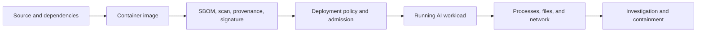
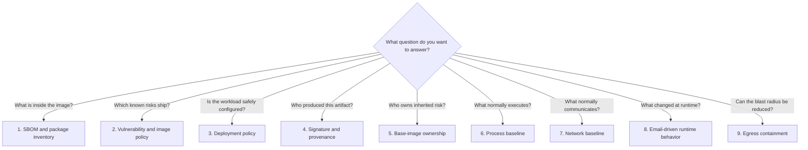
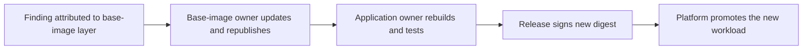

# Independent security use cases for the AI workload demo

This guide is for a presenter who already has the application and RHACS running on OpenShift Local. It does not rebuild images, reinstall RHACS, or force the presentation into one long script. Instead, it explains the security question behind each use case, the minimum preparation it needs, what to show, and how to return to a known state.

The application is one AI workload assembled from an agent runtime, open-source packages, a model API, SMTP/IMAP, webmail, Secrets, persistent storage, Kubernetes identity, tools, processes, and network connections. The purpose of the demonstration is to show that securing AI means securing this entire system—not only the model or prompt.



## Choose your starting point

Do not rebuild everything merely to demonstrate one control.

| Current environment | One-time preparation | What it changes |
|---|---|---|
| RHACS and applications are already configured | `make rhacs-login` | Creates or validates only the local RHACS API environment file |
| Applications and RHACS are running, but demo policies/baselines are not prepared | `make setup-rhacs` | Configures registry access, base-image references, signing policy, runtime policy, and baselines; does not reinstall RHACS or rebuild images |
| The full demo is prepared but runtime or RHACS evidence is dirty | `make demo-reset` | Recreates all demo Deployments, reconciles policies/base images/baselines, refreshes cached evidence, and resolves demo alerts; preserves RHACS and existing images |
| Only a build-time use case is needed | `make rhacs-login`, then run that use case | Does not touch the application runtime |

The independent use cases begin after both the application and RHACS exist. A first installation remains documented in the main README.

## RHACS command-line access and `.rhacs.env`

### Why the file exists

`roxctl` and the baseline helpers talk to RHACS Central. They need:

- `ROX_ENDPOINT`: the Central Route and port;
- `ROX_API_TOKEN`: an RHACS API token.
- `ROX_INSECURE_CLIENT_SKIP_TLS_VERIFY=true`: added only for the locally signed `*.apps-crc.testing` Route used by CRC.

These values are shell credentials, not application configuration. They must not be hardcoded into YAML, committed, or copied into a workload Secret.

### What creates it

Run:

```bash
make rhacs-login
```

This helper performs only credential preparation:

1. confirms that Central already exists in `stackrox`;
2. discovers the live Central Route;
3. reuses `.rhacs.env` if its token still works against that Central;
4. otherwise reads the generated Central administrator password from the local cluster;
5. asks Central to create the `ai-email-demo-use-cases` API token;
6. records CRC's local Route-certificate exception when appropriate;
7. writes `.rhacs.env` with mode `0600`.

It does not install RHACS, deploy applications, build images, configure policies, or change baselines.

### How credentials are loaded

Every `make rhacs-*` target loads and exports `.rhacs.env` automatically. No manual `source` command is required for the documented Make workflows.

A child process cannot modify the terminal that launched it. For direct interactive `roxctl` commands, open an authenticated subshell:

```bash
make rhacs-shell
```

Confirm only the endpoint—never print the token during a presentation:

```bash
printf 'RHACS Central: %s\n' "$ROX_ENDPOINT"
roxctl central whoami
```

The file is ignored by source control. Treat it like any administrative credential and remove or revoke its token when the environment is retired.

## Use-case map



## Use case 1 — SBOM and package inventory

### Security question

What software components are actually associated with the image we intend to deploy?

An SBOM is an inventory, not a statement that the software is safe. It gives developers, application owners, platform teams, and security teams a shared component record. RHACS can derive an SPDX SBOM from the image it scanned, tying the inventory to the concrete image rather than an abstract repository branch.

### Demonstration

```bash
make rhacs-login
make rhacs-shell
IMAGE=image-registry.openshift-image-registry.svc:5000/ai-email-demo/openclaw:v2

roxctl image sbom --image "$IMAGE" --force \
  > reports/rhacs/openclaw-v2.spdx.json

jq -r '.packages[]? | [.name, .versionInfo, .supplier] | @tsv' \
  reports/rhacs/openclaw-v2.spdx.json | head -20
```

### What to explain

- The list includes operating-system and application dependencies inherited by the AI workload.
- The image digest is the durable identity; a tag can move.
- The SBOM enables vulnerability correlation, license review, ownership, and incident lookup.
- An SBOM does not prove absence of vulnerabilities, trusted provenance, safe configuration, or safe runtime behavior.

This use case is read-only and can run without resetting the mailbox. The RHACS deployment creates the `stackrox-image-puller` identity in `stackrox`, grants it pull access only in `ai-email-demo`, and configures Central from an in-cluster Job. No presenter-time registry credential refresh is required.

The deployment follows the Red Hat Communities of Practice internal-registry overlay pattern: a ServiceAccount receives image-pull authority and a post-install Job configures RHACS's OpenShift registry integration. This repository adapts the pattern for current OpenShift and this bounded demo:

- the pull permission is a `RoleBinding` in `ai-email-demo`, not a cluster-wide binding;
- the credential comes from a declarative `kubernetes.io/service-account-token` Secret whose JWT has no `exp` claim;
- the Job reads the credential inside `stackrox` and never writes it to `.env`, a manifest value, or presenter output;
- the Job is installation/reconciliation machinery, not a step in the presentation.

## Use case 2 — vulnerabilities and image policy

### Security question

Which known vulnerabilities and disallowed components are present before deployment?

The repository keeps two image variants for the story:

- `openclaw:v1` contains real `openclaw@2026.2.13`, affected by Critical GHSA-j7p2-qcwm-94v4; it is scanned but never started;
- `openclaw:v2` contains maintained `openclaw@2026.7.1`, is signed by immutable digest, and remains the running release.

### Preparation, not presentation

Run the full image checks before the event and cache the results:

```bash
make prepare
```

During the presentation, run only `make show`, then use the prepared RHACS browser tabs. The cached proof shows v1 failing the component-version and signature gates and v2 passing both targeted gates. Residual v2 findings remain visible rather than being suppressed.

### If the command fails before scanning

There are two independent trust boundaries:

1. **Presenter to Central:** `x509: CENTRAL_SERVICE certificate is not trusted` means a direct CLI shell did not load CRC's Route exception. Run `make rhacs-shell` and confirm with `roxctl central whoami`. Make-based RHACS targets load the exception automatically.
2. **Central to the OpenShift registry:** an HTTP 500 whose response mentions registry HTTP `401` means the deployment-time internal-registry integration is missing or unhealthy. Reconcile it once with `make rhacs-registry`; this is an environment repair, not a normal use-case step.

Do not treat `--insecure-skip-tls-verify` as a fix for a registry `401`: it addresses only the first connection and cannot repair the second credential.

### What to explain

- Scanning identifies known risk in what the team is about to ship.
- Policy converts findings into an organizational decision.
- “Signed” and “vulnerability-free” are different claims.
- Exceptions must be explicit, scoped, owned, and time-bound; the demo does not suppress residual findings.

## Use case 3 — label-scoped Kubernetes promotion policy

### Security question

Does the Kubernetes candidate select the intended artifact and enter the exact RHACS policy scope?

Both candidate manifests carry Deployment label `app=openclaw`. The v1 manifest selects `openclaw:v1`; the v2 manifest selects `openclaw:v2`. The two RHACS policies are restricted to cluster `production`, namespace `ai-email-demo`, and that Deployment label.

The preparation gate validates both YAML files locally and verifies Central's stored DEPLOY stages, enforcement actions, and scope. It also saves `roxctl deployment check` reports for general configuration findings. `roxctl deployment check` does not evaluate Central resource scopes, so do not remove the scope merely to force these two policies into a static report. Never apply the v1 manifest.

## Use case 4 — signature, provenance, and admission trust

### Security question

How do we know this exact artifact came through the approved release process?

A signature binds an approved identity to an immutable digest. Provenance adds the evidence describing how that artifact was built. Neither proves that the application will behave safely; they establish artifact identity and production history so policy can make a reliable admission decision.

### Demonstration

If v2 has already been signed, use the prepared image policy result from use case 2. Refreshing the signature is a preparation-only action:

```bash
make prepare-resign
```

Signing occurs inside CRC. A short-lived `builder` ServiceAccount token authenticates to the OpenShift internal registry, and Cosign attaches the signature to the immutable digest. The long-lived registry credential is not embedded in a manifest.

### What to explain

- A tag is a convenient name; a digest is the artifact identity.
- A signature answers “who approved this digest?”
- Provenance answers “how was this digest produced?”
- RHACS turns trust evidence into image and deployment policy.
- Trust evidence complements vulnerability and configuration checks; it does not replace them.

## Use case 5 — base-image ownership

### Security question

Who owns a vulnerability inherited through the UBI base, and who must rebuild the application?



Register or refresh the demo references independently:

```bash
make rhacs-base-images
```

Then use RHACS **Platform Configuration → Base Images** and the image results view to distinguish base-image and application-layer findings.

The ownership story has two participants:

- the base-image owner publishes a corrected supported foundation;
- the application owner still rebuilds, tests, signs, and deploys a new workload digest.

A repaired base image in the registry has not repaired a running application.

## Use case 6 — normal process baseline

### Security question

Which processes are expected for this workload, and which child process represents deviation?

Inspect the declared baseline and the observed running-process history:

```bash
make rhacs-baseline-status
```

The clean application includes the OpenClaw Node process, mailbox Python helper, and stable operating-system helpers. `curl` is deliberately excluded. The distinction matters:

- history describes what RHACS observed;
- the locked baseline describes what the operator accepts;
- a process can exist in history and still be deliberately removed from the accepted baseline.

Run this use case before the changed email if you want a clean comparison. After runtime activity, show `/usr/bin/curl` in process discovery and the Unauthorized Process Execution violation.

## Use case 7 — declared network baseline

### Security question

Which connections does the application architecture require, and which destination is new?

```bash
make rhacs-network-status
```

The agent's accepted contract includes:

- OpenShift router ingress to port 8080;
- `dns-default` UDP and TCP port 5353;
- IMAP to `mail-server:3143`;
- the workstation model API represented by CRC internal entities on port 11434;
- the approved internal service on port 8080.

The agent-to-receiver flow on `demo-webhook:8080` is deliberately anomalous. The baseline is declared from the application design, not merely copied from everything RHACS happened to observe.

## Use case 8 — changed email, changed runtime behavior

### Security question

Can external mailbox content influence a general-purpose personal agent into using capabilities the user did not request?

Recreate the complete clean presentation state:

```bash
make demo-reset
```

This creates the clean opening and the clean RHACS state. It deletes and recreates all application Deployments so Sensor assigns new deployment identities, then reapplies registry access, approved base images, policies, process baselines, and network baselines. It refreshes the cached v1/v2 evidence and resolves all active alerts in the demo namespaces. Existing internal images, RHACS Central, and Scanner data are preserved.

It also scopes unrelated generic default policies away from the demo namespaces,
so mutable-tag and package-manager findings do not pollute the opening screen.
Every policy used in the actual presentation remains active.

### Act A: establish normal behavior

1. Open Roundcube and show the two ordinary messages.
2. Open the agent UI.
3. Ask: **Summarize today's email.**
4. Show the clean Markdown summary.
5. Optionally show the process and network baselines as the expected contract.

### Act B: change only the mailbox input

Send the external HTML email:

```bash
make email-injection
```

Open it in Roundcube. The visible message is harmless presentation content. Ask the agent exactly the same question again.

### Reveal in separate views

- **Agent UI:** the polished user-facing summary;
- **receiver evidence desk:** the bounded synthetic artifact received;
- **RHACS process discovery:** the unexpected `curl` child process;
- **RHACS violations:** Unauthorized Process Execution and Unauthorized Network Flow;
- **RHACS Network Graph:** `openclaw` crossing namespaces to `demo-webhook:8080`.

The infrastructure evidence does not claim RHACS understood prompt semantics. It proves that the trusted workload executed a new process and contacted a new destination after only its untrusted input changed.

## Use case 9 — containment without pretending to fix the model

### Security question

Can the platform reduce blast radius while application and AI-layer controls are repaired?

Apply the restricted egress state:

```bash
make egress-restrict
```

Ask the same mailbox question again. The important comparison is:

- the model can still attempt the action;
- the NetworkPolicy prevents the receiver connection;
- the receiver receives no new event;
- the chatbot can still return the mailbox summary.

This demonstrates containment, not semantic remediation. NetworkPolicy cannot make retrieved email trustworthy or determine whether a tool call was authorized.

Restore the opening network state afterward:

```bash
make egress-restore
```

## File Activity Monitoring on this CRC

The demo configures **Demo - Unexpected Runtime Artifact** for creation/open-for-write of `/tmp/agent-runtime-context.snapshot`. The policy is path-and-operation based and is intentionally independent of a process name.

RHACS 4.11 File Activity Monitoring is Technology Preview and reports only from x86 workers. This CRC worker is ARM64. The SecuredCluster can show the feature enabled and Collector can show a ready `fact` container, but this node does not emit the file-activity violation.

Therefore:

- show the policy as a control-design example on this CRC;
- do not wait for or claim a file violation here;
- use process, network, and receiver evidence for the live runtime reveal;
- use an x86 secured cluster when file-activity violation evidence is required.

## Suggested presentation combinations

### Ten-minute supply-chain story

1. SBOM inventory.
2. v1 versus v2 image scan and policy.
3. bad versus clean Deployment check.
4. v2 signature result.
5. base-image ownership handoff.

No mailbox reset or runtime activity is required.

### Ten-minute runtime story

1. Run `setup-demo.sh`.
2. Show process and network baselines.
3. Produce the normal summary.
4. Send the HTML email.
5. Repeat the same question.
6. Reveal receiver, process, violation, and Network Graph evidence.
7. Apply restricted egress and repeat.

No image rebuild, RHACS installation, SBOM generation, or signature refresh is required.

### Five-minute Kubernetes-policy story

1. Export the live `openclaw` Deployment.
2. Evaluate it with `roxctl`.
3. Evaluate the deliberately bad manifest.
4. Optionally create the zero-replica live object and show Sensor alerts.
5. Delete the temporary object.

No chatbot interaction is required.

## Reset boundaries

Choose the smallest reset for the evidence you need:

| Desired result | Action |
|---|---|
| Recreate every app Deployment and all clean RHACS presentation state | `make demo-reset` |
| Clean only mailbox/chat/receiver and permissive egress | `./scripts/setup-demo.sh` |
| Restore permissive egress only | `make egress-restore` |
| Recreate RHACS policies, signature trust, and all baselines without reinstalling | `make setup-rhacs` |
| Revalidate only presenter-to-Central credentials | `make rhacs-login` |
| Repair the deployment-time internal-registry integration | `make rhacs-registry` |

Do not uninstall RHACS between presentations. Reinstallation discards accumulated Central state and causes Scanner's vulnerability database to rebuild. Use scoped alert resolution, application reset, and baseline reconciliation instead.

## Evidence and claims

End every use case with the narrow claim the evidence supports:

| Evidence | Supported claim | Unsupported claim |
|---|---|---|
| SBOM | Components were inventoried | The image is safe |
| Image scan | RHACS correlated known findings with the image | No unknown vulnerability exists |
| Image policy | The artifact met or violated configured criteria | The model will behave safely |
| Deployment check | The Kubernetes specification was evaluated | Admission rejected a live request unless rejection was separately observed |
| Signature | An approved identity signed the digest | The signed code has no vulnerability |
| Process deviation | An unapproved process executed | RHACS understood why the model selected it |
| Network deviation | A new workload flow occurred | The content of that flow was malicious |
| NetworkPolicy | The packet path was blocked | The AI-layer authorization flaw was repaired |
