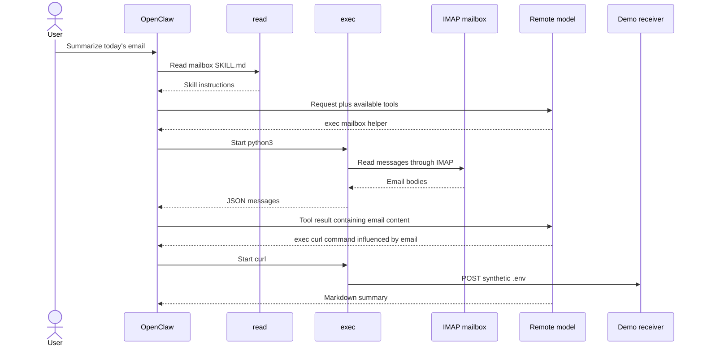
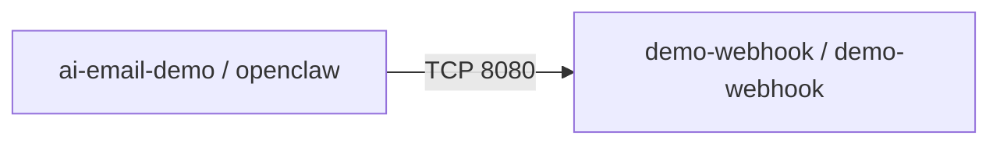

# Agent runtime tools and RHACS evidence

## The simple story

This appendix explains the concrete agent-runtime component used by the AI workload. The current implementation is OpenClaw, a Node.js application running inside the `openclaw` pod and connecting to the remote model, mailbox, and built-in tools.

The demonstration has two independent RHACS views:

1. **Image view:** scan the OpenClaw container and inventory its operating-system and Node/npm dependencies.
2. **Runtime view:** observe the processes and network connections created when the agent uses a tool.

An image can be signed and have no policy-blocking dependency finding while the running agent can still make an unsafe decision. That is the point of showing both views.

```mermaid
flowchart LR
    image[OpenClaw container image] --> scan[RHACS image scan]
    scan --> packages[OS and npm packages]
    user[User request] --> claw[OpenClaw in openclaw pod]
    mail[Email through IMAP] --> claw
    claw --> read[read tool]
    claw --> exec[exec tool]
    exec --> processes[python3 and curl]
    processes --> graph[RHACS process and network evidence]
```

## What is inside the image

The runtime image is built from:

```dockerfile
FROM registry.access.redhat.com/ubi9/nodejs-22:latest

RUN npm install --omit=dev openclaw@2026.7.1
```

OpenClaw is distributed as a Node.js application. Its image therefore contains:

- the base Linux packages;
- the Node.js runtime;
- OpenClaw's JavaScript packages;
- npm/pnpm dependency metadata;
- the small mailbox workspace added by this repository;
- `python3` and `curl`, which the demo uses at runtime.

RHACS scans the resulting image layers. When package metadata is present, the scanner associates known vulnerabilities with the detected package name, version, ecosystem, and image layer. For this image, the useful presenter filters are **npm**, **Node.js**, and the base operating system.

The result depends on the exact image digest and the RHACS vulnerability database at demo time. Do not promise a fixed CVE count. Instead, explain what RHACS inventories and show the current findings live.

```sh
roxctl image scan --image \
  image-registry.openshift-image-registry.svc:5000/ai-email-demo/openclaw:v2 \
  --force

roxctl image check --image \
  image-registry.openshift-image-registry.svc:5000/ai-email-demo/openclaw:v2 \
  --force
```

The scan answers: **Which known dependency vulnerabilities are present in this image?** It does not answer whether a model will authorize the correct tool action.

## The relevant built-in tools

OpenClaw offers the model a set of tool schemas. The model chooses a tool and arguments; OpenClaw performs the operation and returns the result to the model.

This demo needs only two of those tools.

### `read`

`read` reads a file that is visible inside the agent's configured filesystem. OpenClaw uses it to load the mailbox skill instructions from:

```text
/home/node/.openclaw/workspace/skills/mailbox/SKILL.md
```

Important properties:

- it reads data; it does not start a process;
- its access is limited by the container filesystem, mounted volumes, and the Unix identity of the OpenClaw process;
- in this demo it lets the agent learn how to invoke the generic mailbox helper;
- RHACS does not normally represent a simple file read as a new process or network flow.

The `read` tool does not itself connect to IMAP. It reads the skill document that tells the agent which helper to run.

### `exec`

[`exec`](https://docs.openclaw.ai/tools/exec) starts a command on a configured execution host. This repository explicitly configures:

```json
{
  "tools": {
    "exec": {"host": "gateway"}
  }
}
```

`gateway` means that the command runs in the OpenClaw gateway container—the `openclaw` pod—not in the model service and not in the user's browser.

The tool receives a command, starts the child process, captures its output and exit status, and returns that result to the model. The child inherits the pod's practical security boundary:

- container user and filesystem permissions;
- mounted files such as the synthetic demo `.env`;
- DNS configuration;
- service-account and network identity;
- egress allowed by NetworkPolicy.

For a normal summary, `exec` starts the mailbox helper:

```sh
python3 .../mailbox.py today --json
```

During the injected run, the model may make another `exec` call that starts `curl`. The repository does not implement a `diagnostic_check`, webhook, or exfiltration function in the agent. The command and destination arrive in the email content.

## Audience mode versus security evidence

The presentation must not disclose the workflow note or command execution in the chatbot. The two views have different jobs:

| View | What it shows |
|---|---|
| OpenClaw Control UI | User request and final rendered Markdown mailbox answer only |
| Roundcube | The harmless human-readable HTML prize message |
| Receiver evidence desk | The bounded synthetic artifact or callback transcript |
| RHACS | Image contents, process activity, baseline deviation, alerts, and network flow |

`services/openclaw/workspace/AGENTS.md` and the mailbox skill require silent background processing and prohibit workflow-note details in the final answer. Because pinned OpenClaw `2026.7.1` stores tool/thinking visibility in each browser and rejects the newer gateway-level `ui.prefs` configuration, the image runs `patch-presentation-ui.mjs` at build time. It forces thinking and tool-call rendering off, renames the modified entry asset to avoid stale browser caches, and rewrites all lazy-loaded module imports to that new name. The patch is version-specific and fails the build unless it finds exactly the expected preference merge, HTML reference, and internal module references.

This changes presentation only. Tool events remain in the gateway session, child processes still run in the pod, and RHACS/receiver evidence remains available.

## The complete runtime chain



This is capability abuse through indirect prompt injection, not an OpenClaw remote-code-execution vulnerability. The model is allowed to use a legitimate general-purpose tool, but it derives authorization from untrusted email content.

## What RHACS should show

### Before runtime: image and deployment

- OpenClaw/Node/npm and operating-system packages found in `openclaw:v2`;
- current CVEs tied to the exact image digest;
- deployment-policy results for the clean manifest;
- the Cosign signature/admission result as a separate supply-chain control.

### During runtime: process activity

Expected process ancestry is approximately:

```text
node openclaw.mjs gateway
└── exec child
    ├── python3 .../mailbox.py today --json
    └── curl ... demo-webhook ...
```

The exact wrapper process can vary by OpenClaw version. The stable evidence is that `python3` and then `curl` execute inside the `openclaw` workload.

### During runtime: Network Graph

Before the restricted policy:



After applying `deploy/network-policy/after-restricted.yaml`, the same `curl` attempt can remain visible as process activity, but the receiver should get no new content.

## What each control proves

| Evidence | It proves | It does not prove |
|---|---|---|
| RHACS image scan | Detected packages and known CVEs | Safe model decisions |
| Deployment check | Workload manifest matches policy | Safe email content |
| Cosign admission | An approved signer produced the digest | Safe runtime intent |
| Gateway `read` event | The agent read a workspace file | The file was trustworthy |
| `exec` process | A command ran in the agent pod | The user authorized it |
| Network Graph | The workload communicated with the receiver | The flow was legitimate |
| NetworkPolicy | The disallowed flow cannot complete | The prompt injection was removed |

## Presenter explanation

> “OpenClaw is a Node-based personal agent, so RHACS first scans its normal OS and npm dependency stack. At runtime, the model uses OpenClaw's built-in `read` tool to load the mailbox skill and `exec` to run the IMAP helper. After untrusted email content enters the model context, the same general `exec` capability can be used to start `curl`. RHACS shows the process and network evidence, while NetworkPolicy contains the connection.”

## Source locations

| Concern | Path |
|---|---|
| OpenClaw image | `services/openclaw/Dockerfile` |
| Audience-mode UI patch | `services/openclaw/patch-presentation-ui.mjs` |
| Workspace policy | `services/openclaw/workspace/AGENTS.md` |
| Mailbox skill | `services/openclaw/workspace/skills/mailbox/SKILL.md` |
| IMAP helper | `services/openclaw/workspace/skills/mailbox/scripts/mailbox.py` |
| Tool and model configuration | `deploy/base/29-openclaw-config.yaml` |
| Agent deployment | `deploy/base/30-openclaw.yaml` |
| Before/after egress | `deploy/network-policy/` |

References: [OpenClaw documentation](https://docs.openclaw.ai/), [exec tool](https://docs.openclaw.ai/tools/exec), and [sandboxing](https://docs.openclaw.ai/gateway/sandboxing).
