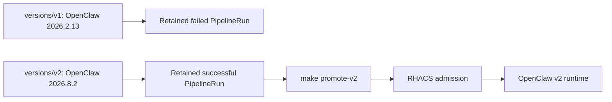
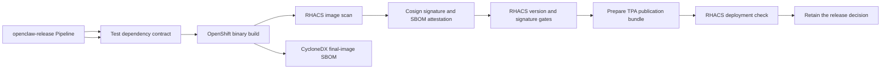
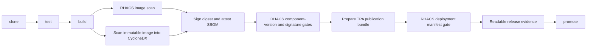

# OpenShift Pipelines demonstration

## Purpose

This act turns the supply-chain discussion into two visible, pre-staged delivery decisions. The failed v1 and approved v2 PipelineRuns are completed before the audience arrives. The only live release action is `make promote-v2`, which submits the already-built immutable v2 digest to RHACS admission and OpenShift.

The application repository contains `devfile.yaml`. Red Hat OpenShift Dev Spaces reads that file and creates the workspace consistently. `.vscode/extensions.json` requests Red Hat Dependency Analytics and Red Hat YAML from Open VSX. No custom code-server deployment is part of the architecture.

The `demo-workstation` image extends the Red Hat Dev Spaces UDI and is built inside OpenShift. It includes the platform CLIs—including Podman—the cached affected and maintained OpenClaw dependency trees, and a shared Python environment at `/opt/demo-venv`. The devfile restores the dependency tree matching the checked-out `package.json` and verifies `npm ls --all --package-lock-only --omit=dev --json` before declaring the workspace ready. Workspace settings and the RHDA `TRUSTIFY_DA_*` environment point Python and pip directly to the shared environment and enable virtual-environment analysis.

Every terminal is a Bash login shell. It loads `/etc/profile.d/rhacs-demo.sh`, which provides the presentation-friendly `rox-check`, `rox-scan`, and `rox-deploy` helpers. The setup creates `rhacs-cli-env` as a Dev Spaces-mounted Secret, so `roxctl` receives `ROX_ENDPOINT`, `ROX_API_TOKEN`, and TLS settings without committing credentials to the repository. The workspace service account receives namespace-scoped delivery access to `demo-platform`, application administration in `ai-email-demo`, and read-only evidence access to `demo-webhook`; it does not receive cluster administration.

For a shell, use the ordinary **Terminal → New Terminal** action. The workspace merges Che Code into the prepared `tools` container and keeps the operator-provided `eclipse-che.terminal` extension enabled, so the standard terminal opens `/bin/bash --login` in `/projects/demo-app`. The `demo-shell` devfile task remains a second deterministic path through **Terminal → Run Task**. The presenter should not need **New Terminal (Select a Container)**.

CRC Route certificates are a browser trust boundary, not a container trust setting. A devfile cannot authorize a browser service worker to bypass an untrusted Route certificate. Use `make devspaces-open`: it launches an isolated Chrome profile pinned to the current CRC ingress public key. It changes neither the macOS keychain nor global browser trust, and it does not require repeating a certificate installation after demo reset.



Each retained PipelineRun still contains the complete evidence chain:



## Why each component exists

| Component | Responsibility |
|---|---|
| OpenShift Dev Spaces | Reproducible browser-based developer environment controlled by `devfile.yaml` |
| Red Hat Dependency Analytics | Developer-time dependency, license, remediation, and SBOM feedback |
| Gitea | Small, self-contained Git service for the disconnected presentation story |
| Tekton EventListener | Converts an authenticated push to protected `main` into a PipelineRun |
| OpenShift Pipelines | Makes every build and security decision a separate observable Task |
| Pipelines console plugin | Presents PipelineRuns and Task evidence directly in the OpenShift Console |
| OpenShift internal registry | Stores candidate images, signatures, and promoted tags |
| RHACS | Evaluates the exact image and the Kubernetes deployment before promotion |

## Pipeline contract

The `openclaw-release` Pipeline accepts an immutable Git revision and a unique candidate image tag. It cannot promote an image unless every earlier Task succeeds.



### Clone

Clone the repository and check out the exact commit SHA delivered by Gitea. The pipeline never rebuilds a moving branch head.

### Test

Verify the repository contract, Dev Spaces metadata, and the selected `versions/v1` or `versions/v2` candidate. RHACS—not this syntax check—makes the release decision.

### Build

Use one OpenShift `openclaw-v1` BuildConfig and one image recipe. The Task overlays either `versions/v1` or `versions/v2` into that context, stores each result under a unique candidate tag, and returns its immutable digest. The version directories describe release inputs; they do not duplicate the application image recipe.

### SBOM

After the build returns an immutable digest, Syft pulls that exact image from the OpenShift internal registry and generates `openclaw-image.cdx.json`. The document therefore inventories what is shipped: UBI operating-system packages, the Node runtime, OpenClaw, and application dependencies. It is retained under `.pipeline-sbom` on the PipelineRun's per-run workspace PVC. Manifest and TPA evidence use separate directories so parallel Tekton Tasks running under different OpenShift UIDs cannot race over directory ownership. This build-time final-image SBOM complements developer-time Dependency Analytics and RHACS Scanner's independent final-image inventory. No idle evidence claim exists before a run, so CRC does not show a misleading Pending PVC.

### Sign

Use Cosign 2.4.3 with the established CRC-compatible digest-tag signature format. The same Task attaches the CycloneDX document to the immutable digest as an OCI attestation. `cosign download attestation` can recover that build SBOM later. Registry authentication comes from the PipelineRun ServiceAccount token at execution time; no rotating registry token is stored in a long-lived Secret.

From the prepared Dev Spaces terminal, recover and verify the SBOM with one presenter command:

```bash
make image-sbom-attestation
```

The target uses the readable `openclaw:v2` release tag, obtains only the public
Cosign key, verifies the digest-bound CycloneDX attestation, extracts its
predicate, and saves it as `sboms/openclaw-attached.cdx.json`. It then prints
the format, component count, and OpenClaw version. Cosign resolves the tag to
the immutable digest during verification. Downloading alone proves only that
an attachment exists; the target deliberately verifies the attestation before
presenting its contents.

The full raw CLI sequence, including registry authentication and public-key retrieval, is documented in [COSIGN-SBOM-DEMO.md](COSIGN-SBOM-DEMO.md). New Dev Spaces terminals source `scripts/cosign-demo-env.sh` automatically, so `$IMAGE`, `$COSIGN_PUBLIC_KEY`, `/tmp/cosign.pub`, and `DOCKER_CONFIG` are ready before the presenter runs Cosign.

### RHACS gate

The RHACS Tasks perform deterministic proofs:

1. `roxctl image check` evaluates the custom OpenClaw component/version policy and the approved-Cosign-signature policy. Both policies are marked Critical, but neither is a generic “fail every Critical CVE” gate.
2. `roxctl deployment check` must reject `deploy/rhacs/bad-workload-security.yaml`, which deliberately requests privilege, UID 0, host networking, and a host filesystem mount.
3. `roxctl deployment check` must accept the digest-pinned `deploy/rhacs/clean-openclaw.yaml` release manifest.

The unsafe manifest is a negative control and is never submitted to the Kubernetes API.

### TPA publication point

After the image gates pass, the Pipeline prepares the real CycloneDX SBOM and digest metadata for Red Hat Trusted Profile Analyzer. TPA is not installed in this CRC environment, so the Task explicitly records `demonstration-only-no-endpoint-configured` and does not claim an upload. This stage intentionally runs before the deployment check: software-composition evidence belongs to the approved image, while the later gate evaluates the Kubernetes manifest as a different object.

### Release evidence

The `release-evidence` Task turns the successful dependencies into a compact presenter view in OpenShift Pipelines: component/version policy, signature policy, SBOM attestation, TPA bundle, deployment manifest, and final decision. Detailed `roxctl` logs remain available for investigation, but they are not the primary audience view.

### Promote

The pre-staged v2 PipelineRun deliberately skips its promotion Task. During the talk, `make promote-v2` reads the successful run's immutable digest and submits it to the existing Deployment. The script pauses the rollout, stops v1, replaces the `openclaw-state` PVC, and starts v2 only after the fresh claim exists. This avoids state migration while retaining the Deployment identity and RHACS baselines. RHACS deployment-update admission is already enabled. This makes admission—not image build latency—the live event.

## Preparation

Run this once before the presentation:

```sh
make demo-reset
make pipeline-status
```

The reset retains exactly two runs: rejected v1 and approved v2. It leaves v1 running and v2 undeployed. No source edit, push, image build, scan, or signature operation is required during the talk.

During `make demo-reset`, the Gitea repository is deleted and recreated, and one signed commit containing both candidate records is pushed before the webhook is installed. Therefore the administrative reset cannot accidentally trigger Tekton. The two presentation PipelineRuns are then created explicitly with promotion disabled.

`make pipelines-setup` explicitly preserves the existing OpenShift Console plugins, adds `pipelines-console-plugin`, waits for its pod, and verifies that it remains enabled. The presenter should not need `tkn` for the live walkthrough.

Open these browser tabs before the session:

1. OpenShift Dev Spaces workspace.
2. Gitea repository and webhook delivery page.
3. OpenShift Console, **Pipelines** view.
4. RHACS image and policy views.
5. OpenClaw route.

## Live presenter flow

This is the primary audience path. It deliberately uses the browser and OpenShift Console instead of presenter-side scripts.

### Opening state

The opening `openclaw:v1` container image is deliberately unsigned and contains `openclaw@2026.2.13`. The reset's pre-staged assessment disables the signing Task for that one PipelineRun so RHACS evaluates the artifact exactly as it exists at the opening. It must stop at `rhacs-image-check` with two named violations:

1. `Demo - Critical OpenClaw release blocked`
2. `Demo - Unsigned OpenClaw release blocked`

Do not confuse this with the repository commit: the source commit is SSH-signed so the pipeline can prove developer identity, while the opening container image has no approved Cosign signature. Ordinary webhook-triggered release runs retain the default `sign-candidate=true`; the remediated pipeline signs the new immutable image digest after build, SBOM generation, and scanning, then receives the final two-policy approval.

Before the audience arrives, run `make demo-reset` once. Confirm the following in the browser:

1. Dev Spaces opens the `developer/demo-app` repository at the single seed commit.
2. `versions/v1/package.json` contains the exact dependency `"openclaw": "2026.2.13"`.
3. OpenShift Pipelines shows exactly two `openclaw-release` runs: failed v1 and successful v2.
4. Its `rhacs-image-check` Task says that `openclaw@2026.2.13` violates **Demo - Critical OpenClaw release blocked**.
5. RHACS still shows the already-running affected workload because deployment enforcement is detect-only during this teaching sequence.

Say:

> The application is already running, but the new delivery policy now rejects the same affected component. This lets us discover the problem, trace it to source, and repair it without pretending the existing workload never existed.

### 1. Compare the prepared decisions

Say:

> We begin where developers work. This workspace was not configured manually. The repository describes it with a devfile, including its tools and recommended extensions.

Open `versions/v1/package.json` and `versions/v2/package.json`. Show the exact dependency change from 2026.2.13 to 2026.8.2, then compare the two completed PipelineRuns. Explain that the same source-to-image workflow produced both decisions before the live session.

### 2. Pipeline graph

Switch to the OpenShift PipelineRun. Follow the graph from left to right. Do not open every Task log. Open only the evidence that matches the current slide:

- Dependency and test slide: `test`.
- SBOM slide: `sbom`.
- Provenance and signature slide: `sign`.
- RHACS build and deployment policy slide: `rhacs`.
- Promotion slide: `promote`.

### 3. Security decision

In the RHACS Task, show that the deliberately unsafe YAML was rejected and the release YAML passed. Then show the image policy result for the exact digest.

Say:

> A signature does not mean that software is safe. It identifies the producer and protects the artifact identity. RHACS still evaluates what is inside the image and how we intend to run it.

### 4. Admission and runtime transition

Run:

```sh
make promote-v2
```

The command prints the candidate, pipeline evidence, and immutable digest, then submits the Deployment update. After RHACS admission accepts it and the rollout completes, open the OpenClaw application. Mailbox reads are pre-authorized by the isolated demo configuration, so no approval card should interrupt the runtime act.

Say:

> Build-time controls reduced known risk and established trust in the release. They did not remove the need for runtime controls. We now move from what we shipped to what the workload actually does.

Continue with the email and RHACS runtime demonstration.

## Failure handling

| Symptom | Meaning | Presenter fallback |
|---|---|---|
| Dev Spaces still starts | Operator or workspace image pull is incomplete | Show Gitea and a previously completed PipelineRun |
| Dependency Analytics has no result | Open VSX or the hosted analysis service is unavailable | Compare the affected and maintained records already cached in the workspace, then continue with the pipeline |
| Webhook does not create a run | EventListener Route or hook delivery failed | Run `make pipeline-run` |
| Build is slow | The candidate image is not cached | Show the completed rehearsal run |
| Pods remain Pending with an untolerated disk-pressure taint | CRC image storage crossed the kubelet eviction threshold | Use the prepared 300 GiB CRC disk profile and remove disposable completed builds before the session |
| RHACS enrichment is pending | Scanner has not indexed the new digest/signature | The Task retries for two minutes; use cached evidence if needed |
| Promotion is blocked | A real gate failed | Do not bypass it; explain the evidence and use the previously approved digest |

## Security boundaries

- Gitea accepts registration from nobody; only the fixed demo administrator exists.
- The webhook uses a fixed demonstration authorization value stored in a Secret and is restricted to the expected repository and `main` branch.
- The PipelineRun ServiceAccount is namespace-scoped and cannot administer the cluster.
- Candidate images receive unique commit-derived tags.
- Promotion uses the digest returned by the build, not a floating tag.
- RHACS and signing credentials are Kubernetes Secrets and are not committed to Gitea.
- The unsafe YAML is checked as a file and is never deployed.

The fixed passwords and webhook value are for an isolated CRC presentation only. A production design would use enterprise identity, protected branches, short-lived workload identity, external key management, and a supported enterprise Git provider.

## Single-node CRC resource profile

This repository deliberately uses small requests because CRC has one worker. The application services request tens of millicores; OpenClaw requests 100m CPU and 512 MiB; Gitea requests 50m CPU and 256 MiB; and the Dev Spaces tools container should remain below 100m CPU and 768 MiB. These are lab values, not production sizing recommendations.

Disk is the more important constraint during repeated image builds. Prepare this full RHACS, Pipelines, Dev Spaces, and AI-workload lab with a 300 GiB CRC disk:

```sh
crc config set disk-size 300
crc stop
crc start
```

The setup and reset paths delete disposable failed PipelineRuns and completed build objects. They do not reinstall RHACS or delete its vulnerability database.
