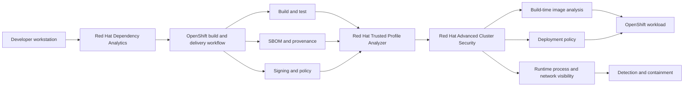
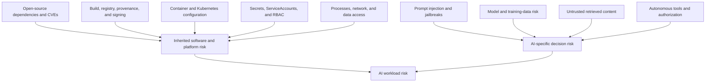
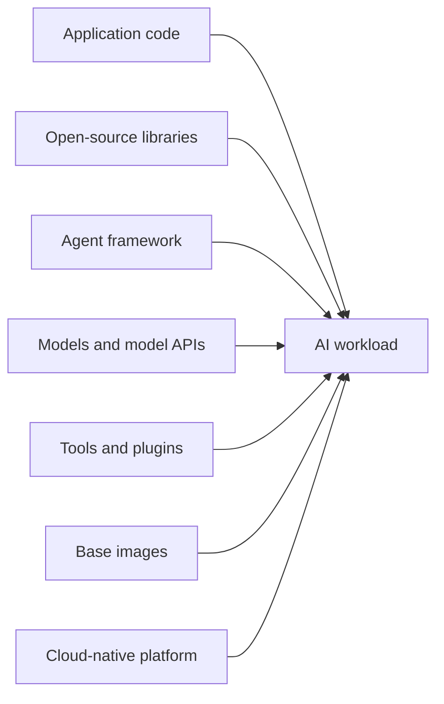
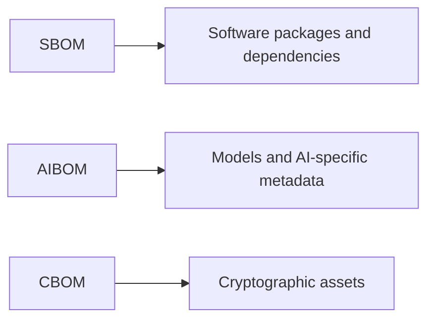
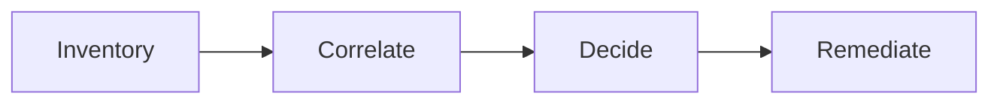
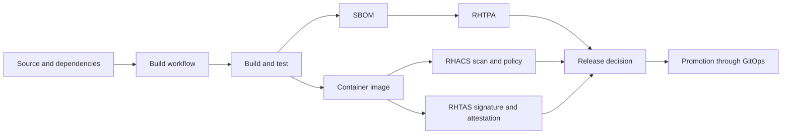
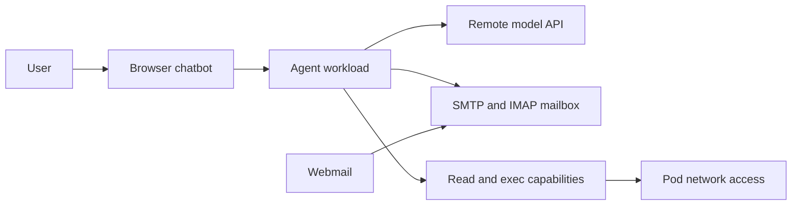
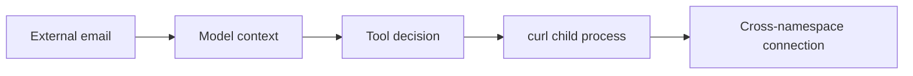
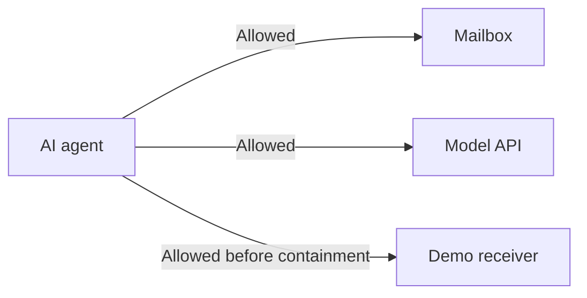
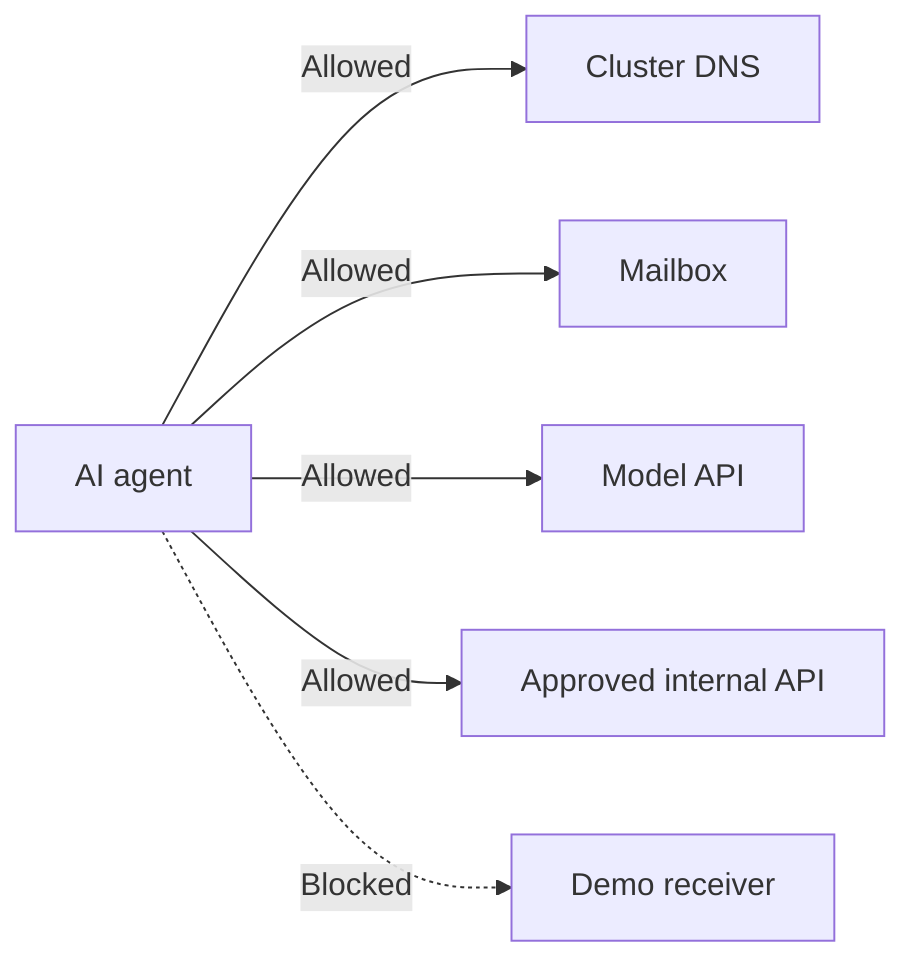

# AI workload security: presentation story

## Purpose

This is the narrative for a slide deck. It introduces the problem and products before descending into the live email-agent demonstration.

Detailed delivery language, transitions, persona cues, and Q&A responses are in [`SPEAKER-NOTES.md`](SPEAKER-NOTES.md).

The storyline is deliberately broader than one product:



The email agent is the example AI workload. OpenClaw, GreenMail, Roundcube, DeepSeek, and the receiver are implementation components, not the subject of the session.

## Opening thesis — AI security is bigger than the model

When people hear “AI security,” the conversation often jumps directly to:

- model safety;
- prompt injection;
- jailbreaks;
- data leakage through prompts;
- model poisoning.

Those risks matter, but the model does not run alone. An AI workload inherits every security concern of the software and platform around it:



The key idea is additive:

```text
AI workload security
    = software supply-chain security
    + application security
    + container and Kubernetes security
    + identity, secrets, and network security
    + model, data, prompt, retrieval, and tool security
```

AI does not replace traditional security boundaries. It increases their importance because a probabilistic decision can activate real software capabilities.

Opening statement:

> **We should secure the model—but we must deploy, inventory, sign, configure, observe, and contain the complete AI workload.**

## Audience and personas

The same story should work for several roles. Each role asks a different question about the same evidence.

| Persona | Primary question | Relevant capability | Demo evidence |
|---|---|---|---|
| Developer | Is this dependency safe to introduce? | Red Hat Dependency Analytics | Package finding before build |
| AI/application engineer | What libraries, agent tools, and model connections make up my workload? | Dependency analysis, SBOM/AIBOM, application controls | Node/npm inventory, model endpoint, `read`/`exec` capabilities |
| Platform engineer | Can teams get a secure path to production without constructing it repeatedly? | OpenShift builds, pipelines, GitOps, signing, policy | Repeatable OpenShift build and deployment |
| AppSec engineer | What shipped, and does it satisfy policy? | RHTPA composition analysis and RHACS scanning | SBOM, affected/remediated digest scan, bad/clean manifest checks |
| Security operations | What is the workload doing now? | RHACS process and network visibility | `python3`, `curl`, and the cross-namespace flow |
| Cloud/Kubernetes security | How far can a wrong decision reach? | ServiceAccount, RBAC, RHACS, NetworkPolicy | Restricted identity and blocked receiver flow |
| Risk/compliance | Can we prove composition, provenance, and control decisions? | SBOMs, attestations, signatures, immutable evidence | Component inventory, signed digest, policy result |
| Engineering leadership | Can we move quickly without making every team a supply-chain specialist? | Integrated developer and platform workflow | One reusable code-to-cluster path |

## The one-sentence product story

> **Dependency Analytics helps the developer choose; RHTPA records and analyzes what is inside; Cosign establishes artifact trust; RHACS controls what reaches the cluster and observes what it does there.**

## Slide sequence

### Slide 1 — AI velocity changes the risk equation

Title:

```text
AI workloads move fast—and inherit everything
```

Visual:



Speaker point:

> “The AI model is only one dependency. An AI workload also inherits an application framework, package ecosystems, tools, images, credentials, identity, and network reach.”

Make the distinction explicit:

> “Prompt injection is an AI-layer cause. A child process, vulnerable package, leaked Secret, excessive ServiceAccount, or unrestricted network path is an infrastructure consequence. A credible security program must address both.”

Persona emphasis:

- executives: increased velocity and expanded exposure;
- engineers: composition complexity;
- security: more trust boundaries and autonomous actions.

### Slide 2 — AI security is a lifecycle problem

Title:

```text
No single control answers every question
```

| Phase | Security question |
|---|---|
| Workstation | Should the developer introduce this dependency? |
| Source and pipeline | Can we build it consistently and securely? |
| Artifact | What is inside it and where did it come from? |
| Admission | Does it meet enterprise policy? |
| Runtime | What processes and connections actually appeared? |
| AI decision layer | Should retrieved content be allowed to invoke a tool? |

Speaker point:

> “We need connected controls, but we must preserve their boundaries. A valid signature does not predict model intent, and runtime telemetry does not explain the semantics of an email.”

### Slide 3 — Start at the developer workstation

Title:

```text
Red Hat Dependency Analytics: fix risk before it becomes an artifact
```

Explain:

- dependency intelligence appears where developers choose packages;
- developers can inspect known vulnerabilities and remediation information without waiting for a container build;
- current Dependency Analytics capabilities include package/workspace analysis, CycloneDX SBOM generation, and Dockerfile analysis;
- the objective is fast, informed selection—not transferring all responsibility to the developer.

Demo mapping:

- open `versions/v1/package.json`: the single candidate begins with affected `openclaw@2026.2.13`;
- update the same v1 dependency and lockfile to maintained `2026.8.2`; the pipeline then proves what reached the final image.

Speaker point:

> “The cheapest vulnerable component to fix is the one that has not entered the build yet.”

Presentation action: explain rather than demo. Show a screenshot or the deliberately obsolete dependency file, pause on the version, and move on. The live technical proof starts after the image exists.

### Slide 4 — What is an SBOM?

Title:

```text
SBOM: the ingredient list for software
```

An SBOM is a machine-readable inventory of software components and relationships associated with an artifact. It commonly records:

- component names and versions;
- package identifiers such as PURLs;
- supplier or origin information when available;
- dependency relationships;
- licenses and hashes when provided;
- the artifact or product the components belong to.

Explain what it is not:

- not a guarantee that the software is vulnerability-free;
- not proof that the artifact came from an approved builder;
- not a runtime behavior record;
- not automatically a model inventory.

Use the distinction:



Speaker point:

> “An inventory becomes valuable when it is tied to an immutable artifact and continuously correlated with changing vulnerability intelligence.”

Connect the generation paths without conflating them:

- Dependency Analytics can generate a source-oriented CycloneDX SBOM;
- build pipelines can produce and attach SBOM evidence for every immutable release;
- RHACS can generate an SPDX 2.3 SBOM from its image scan;
- RHTPA makes SBOM and vulnerability knowledge searchable across products.

### Slide 5 — Introduce RHTPA

Title:

```text
RHTPA: turn inventories into supply-chain decisions
```

Red Hat Trusted Profile Analyzer is the software-composition and supply-chain analysis layer. It ingests SBOMs and VEX, correlates packages with vulnerability intelligence, and preserves product/release context.

Explain its role:

- ingest and validate SBOM documents;
- correlate packages, versions, advisories, and vulnerabilities;
- preserve product, release, and provenance context;
- exchange VEX so known findings can carry applicability decisions;
- identify every affected product when new intelligence arrives;
- separate base-image ownership from application-layer ownership.

Speaker point:

> “An SBOM file is evidence. TPA turns many SBOMs into organizational knowledge: where a component exists, which release contains it, who owns its layer, and what changed when new vulnerability intelligence arrived.”

Use this four-word ladder on the slide:



Explain that provenance records where, when, and how an artifact was produced. TPA preserves and correlates composition evidence; Cosign binds an approved identity to the immutable digest; RHACS verifies that signature and applies workload policy.

### Slide 6 — Connect composition, provenance, and enforcement

Title:

```text
The pipeline connects evidence and decisions
```



Speaker point:

> “TPA supplies composition intelligence and ownership context. Cosign supplies registry-backed artifact trust. RHACS verifies the image, evaluates the deployment, and observes the running workload.”

### Slide 7 — Base images turn findings into ownership

Title:

```text
The CVE is shared; the remediation work is not
```

Use TPA's product/release knowledge and RHACS layer context to route remediation to the right owner.

Use cases:

- base-image owner repairs and publishes the approved foundation;
- application owner upgrades direct npm/Python dependencies;
- application owner rebuilds even when the fix came from the base-image team;
- platform/security owner verifies that the repaired digest is scanned, signed, and promoted;
- TPA identifies every product/release still carrying the affected component.

Speaker point:

> “Layer origin tells us where remediation starts. It does not remove the application owner's responsibility to rebuild and promote a new immutable digest.”

### Slide 8 — Introduce RHACS

Title:

```text
RHACS: protect the Kubernetes workload across build, deploy, and runtime
```

Explain the three stages:

| Stage | RHACS contribution | Example in this demo |
|---|---|---|
| Build | Image/package vulnerability scanning and CI policy | Compare the affected and remediated candidate digests |
| Build | SPDX 2.3 SBOM generation from an image scan | Export the exact promoted-image inventory |
| Deploy | Kubernetes configuration and admission policy | Flag privileged manifest; assess clean manifest and signature policy |
| Runtime | Process, deployment, and network visibility with configured policy response | Observe `curl` and the receiver flow |

Speaker point:

> “RHACS does not need to understand the model's reasoning to see the infrastructure consequence of its decision.”

### Slide 9 — How the products complement one another

Title:

```text
One lifecycle, different control owners
```

| Product/capability | Primary job | Handoff |
|---|---|---|
| Dependency Analytics | Developer-time dependency choice | Safer source enters the pipeline |
| Build workflow | Repeatable build, test, and promotion | Produces artifact and evidence |
| RHTPA | SBOM ingestion, composition analysis, vulnerability correlation | Supplies searchable risk knowledge |
| RHTAS | Signing, provenance, and attestation | Establishes artifact trust |
| RHACS | Image/deployment policy and runtime workload protection | Controls and observes cluster risk |
| OpenShift | Runs the workloads and enforces Kubernetes controls | Provides execution, identity, and network boundary |
| Application/AI controls | Authorizes model and tool behavior | Addresses the semantic decision boundary |

Avoid a competitive framing. These controls are complementary because they answer different questions.

### Slide 10 — Meet the example AI workload

Title:

```text
A personal email agent on OpenShift
```



Describe only what the audience needs:

- the user asks the agent to summarize today's email;
- the mailbox is real SMTP/IMAP;
- the model is a remote service;
- the agent runs as a normal OpenShift workload;
- its general tools can create normal Linux processes.

Do not lead with implementation names. Mention them only when showing the concrete architecture or troubleshooting.

### Slide 11 — Supply-chain walkthrough

Title:

```text
Before runtime: what are we about to trust?
```

Story:

1. Dependency Analytics identifies risk at the workstation.
2. The build workflow produces an immutable image.
3. The pipeline produces an SBOM and provenance evidence.
4. RHTPA records and analyzes composition.
5. RHACS scans the final image and evaluates policy.
6. RHTAS signs the immutable digest.
7. RHACS policy and admission decide whether it may progress.

Demo evidence:

- deliberately obsolete opening-package findings;
- deliberately privileged manifest failure;
- maintained candidate Node/npm package inventory;
- clean digest-pinned Kubernetes manifest, evaluated separately from remaining package findings;
- promoted-digest signature/admission result when configured.

### Slide 12 — Everything passes; then the input changes

Title:

```text
The artifact remains trusted—but the workload receives untrusted data
```

```text
CODE              unchanged
IMAGE             unchanged
SBOM              unchanged
SIGNATURE         unchanged
DEPLOYMENT        unchanged
MODEL             unchanged
USER REQUEST      unchanged

MAILBOX CONTENT   changed
```

Speaker point:

> “Supply-chain controls worked correctly. They established what was built and whether it met policy. They were never designed to predict every future input.”

### Slide 13 — Runtime consequence

Title:

```text
From untrusted content to workload behavior
```



Show:

- the same user request;
- a normal-looking HTML email in webmail;
- the normal Markdown chatbot response;
- RHACS process activity;
- RHACS Network Graph;
- bounded synthetic receiver evidence.

Keep the chatbot in audience mode: show only the user prompt and final Markdown answer. Do not reveal thinking, activity cards, command text, or workflow-note acknowledgements there. Reveal the underlying behavior only after switching to the receiver and RHACS views.

Key sentence:

> **RHACS did not detect a malicious email. It observed the workload behaving differently because of that email.**

### Slide 14 — Containment

Title:

```text
Assume an autonomous workload can eventually make a wrong decision
```

Before:



After:



Clarify ownership:

- RHACS shows the deployment/process/network context;
- OpenShift networking enforces NetworkPolicy;
- application controls must still fix the unsafe authorization decision.

### Slide 15 — Persona outcomes

Title:

```text
One evidence chain, different decisions
```

| Persona | Takeaway |
|---|---|
| Developer | Choose safer dependencies before build |
| Platform team | Offer a paved path with security evidence by default |
| AppSec | Enforce policy on source, composition, image, and manifest |
| SecOps | Investigate actual process and network behavior |
| Compliance | Trace components, provenance, and promotion decisions |
| AI engineer | Treat retrieved data as untrusted and constrain tools |
| Leadership | Increase AI delivery speed without surrendering control |

### Slide 16 — Close

Title:

```text
Secure the AI workload, not only the model
```

```text
Know what developers select.
Know what the pipeline builds.
Know what the artifact contains.
Control what may deploy.
Observe what actually runs.
Limit what it can reach.
Protect the AI decision boundary separately.
```

Closing line:

> **AI introduces new trust boundaries. A trusted software supply chain and runtime controls determine how far a bad decision can go.**

## Minimal live-demo transition

The slide deck should carry the product explanation. The terminal is only a trigger.

Pre-stage before the session:

- completed build and provenance evidence;
- Dependency Analytics finding;
- SBOM/RHTPA view;
- affected/remediated RHACS scan and deployment-policy results;
- signature/admission evidence;
- running workload and a version-aware browser connection helper;
- normal mailbox baseline;
- RHACS process and network telemetry.

Prepare the clean base state immediately before presenting:

```sh
make demo-reset
```

It recreates all application Deployments, erases prior agent sessions, applies the configured mailbox login, seeds normal mail, clears receiver evidence, and rebuilds the RHACS policy/baseline state for the new deployment identities. Existing images and RHACS Scanner data are reused. It does not send the injected message or execute the chatbot smoke request. `make credentials` detects whether v1 or v2 is running; for v2 it approves pending browser device requests after the presenter first clicks **Connect**.

Live commands:

```sh
# Optional: replay the prepared CI gate
make rhacs-gate

# Introduce the changed runtime input
make email-injection

# Contain the observed network consequence
make egress-restrict
```

Use browsers for everything else:

- slides for product concepts;
- Dependency Analytics/RHTPA/RHACS for evidence;
- Roundcube for the human email view;
- chatbot for the repeated user request;
- RHACS for process and network evidence.

## Product boundaries to preserve

| Do say | Do not say |
|---|---|
| RHTPA manages and analyzes SBOM-based supply-chain data | An SBOM proves software is secure |
| RHTAS establishes signing, provenance, and attestation evidence | A signature proves safe runtime intent |
| RHACS protects Kubernetes workloads across build, deploy, and runtime | RHACS semantically detects prompt injection |
| OpenShift NetworkPolicy enforces the demonstrated packet boundary | RHACS itself is the network dataplane |
| Agent/application controls must authorize sensitive tool actions | Infrastructure containment fixes the AI-layer weakness |

## Official product references

- [RHACS build, deploy, and runtime lifecycle](https://docs.redhat.com/en/documentation/red_hat_advanced_cluster_security_for_kubernetes/4.8/html/release_notes/release-notes-48)
- [RHTPA overview](https://docs.redhat.com/en/documentation/red_hat_trusted_profile_analyzer/2/html/administration_guide/con_overview-of-red-hat-trusted-profile-analyzer_admin)
- [RHTPA SBOM, AIBOM, and CBOM analysis](https://docs.redhat.com/en/documentation/red_hat_trusted_profile_analyzer/2/html-single/administration_guide/administration_guide)
- [Red Hat Dependency Analytics 1.0](https://developers.redhat.com/articles/2026/07/07/dependency-analytics-10-ai-coding-supply-chain-security)
