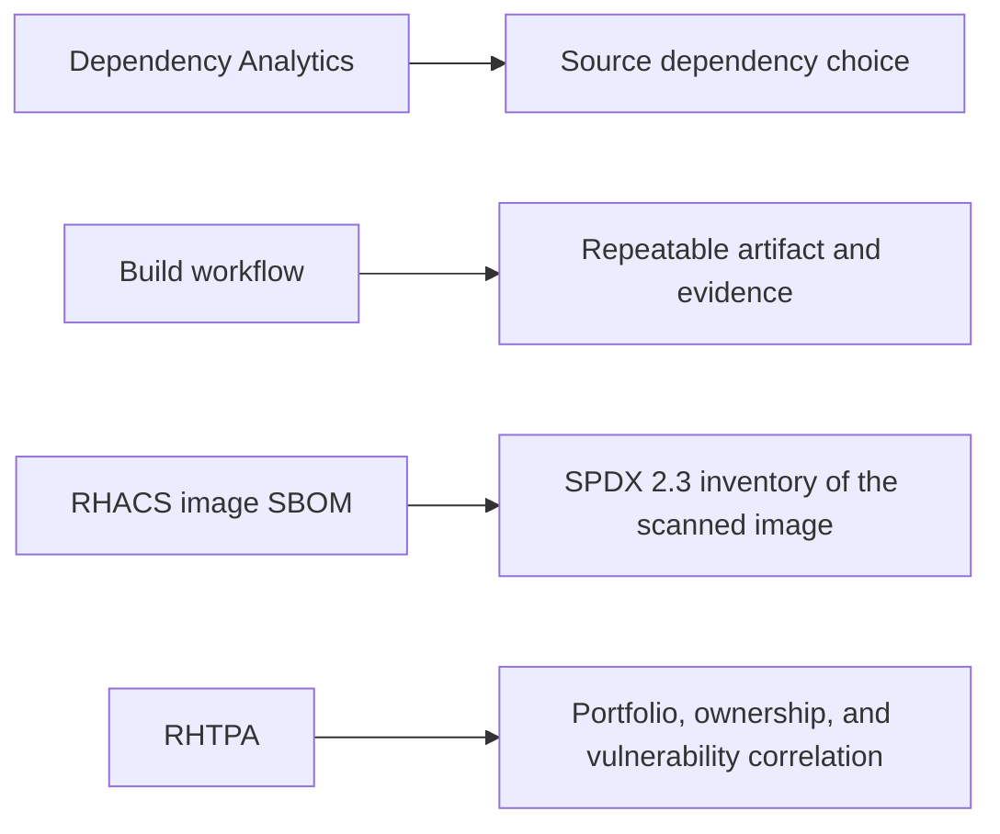
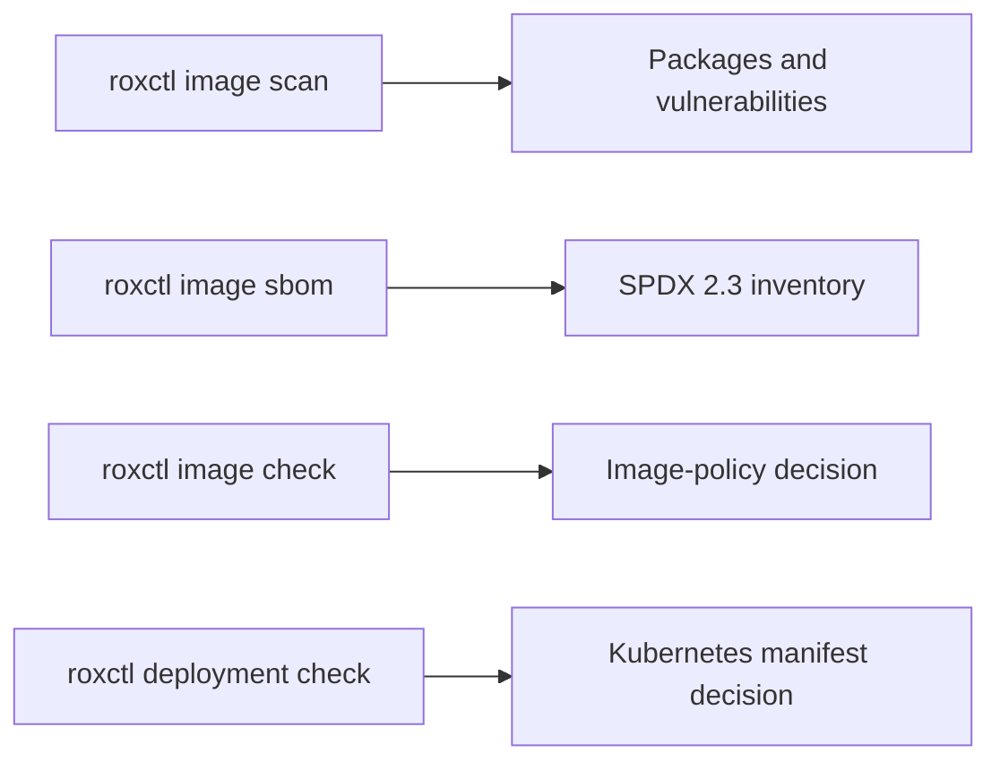

# Speaker notes: securing AI workloads from code to cluster

## Delivery transition script

> “Now we move from developer feedback to a release decision. This browser workspace is OpenShift Dev Spaces. It already contains Git, OpenShift CLI, RHACS CLI, Kustomize, SBOM tools, and Cosign. Nothing is installed on the presenter laptop.”

> “The developer commit is signed, and the pipeline verifies that signature first. OpenShift builds the image and generates a CycloneDX SBOM. RHACS scans the candidate. Cosign signs the exact image digest and attaches the build SBOM to that digest.”

> “Our opening image fails for two independent reasons. It contains the affected OpenClaw component version, and nobody approved this image digest with our Cosign key. The source commit is signed, but the container image is not. These are different trust decisions. We mark both custom policies as Critical because they stop this release, but this is not a generic rule that fails every Critical vulnerability.”

> “After the image gates pass, we prepare the SBOM publication bundle for Trusted Profile Analyzer. TPA is not installed in this lab, so we do not pretend to upload it. Then RHACS checks the Kubernetes deployment manifest. This order matters: the SBOM describes the approved image; the next check evaluates how that image will run.”

> “I prepared both decisions before this session. One pipeline run shows why v1 was rejected. The other shows why v2 earned approval. This lets us discuss the evidence without waiting for a build.”

> “RHACS keeps `ai-email-demo` as the user workload. The pipeline, Dev Spaces, Gitea, sender, and receiver namespaces are custom platform components, so supporting machinery does not obscure the workload risk.”

### Live delivery script

> “We start with a clean but realistic problem. The affected application is already running. RHACS policy was introduced afterward, so the existing workload is visible as risk and the next candidate is rejected. This is how teams often discover inherited supply-chain risk in a real environment.”

Open the failed v1 PipelineRun and its `rhacs-image-check` Task, then place the successful v2 run beside it.

> “The decision is specific. RHACS found the component named OpenClaw at version 2026.2.13. Our policy requires the maintained baseline. The pipeline stopped before signing, publication, or promotion.”

Move to Dev Spaces and compare `versions/v1/package.json` with `versions/v2/package.json`.

> “Red Hat Dependency Analytics brings dependency context close to the source. Here are the two exact records used for the prepared runs: affected v1 and maintained v2.”

Do not rebuild or push during the presentation. Open the successful v2 graph and follow the prepared evidence.

Follow the Pipeline graph without opening every log. Pause at these Tasks:

1. `verify-commit`: “The source revision has an approved developer signature.”
2. `build`: “OpenShift built a commit-specific candidate in its internal registry.”
3. `sbom`: “Syft inventoried the immutable final image, not only the source folder.”
4. `sign`: “Cosign signed that digest and attached the same CycloneDX SBOM as an attestation.”
5. `rhacs-image-check`: “The maintained component and approved-signature policies both pass.”
6. `prepare-tpa-publication`: “This bundle is where TPA would ingest the SBOM and digest metadata. TPA is not installed here, so the pipeline says that clearly.”
7. `rhacs-deployment-check`: “The image passed; now RHACS evaluates the separate Kubernetes object.”
8. `release-evidence`: “This is the compact audience view. Detailed `roxctl` logs still exist behind it.”
9. `promote`: “This step was deliberately held. I will submit the exact digest separately so we can watch admission.”

Pause on the evidence card:

> “The release was not trusted because one scanner returned green. It earned promotion through connected evidence: signed source, repeatable build, final-image inventory, signature, image policy, deployment policy, and an immutable digest.”

Run `make promote-v2`, pause on the RHACS admission message, and then open OpenClaw.

> “Nothing is rebuilding now. RHACS is deciding whether this already-approved immutable digest may replace the running v1 workload. It is accepted, and v2 becomes our runtime subject.”

## Rehearsal status

The complete Dev Spaces-to-promotion delivery path was rehearsed again on 2 September 2026. A signed developer push triggered Gitea, all thirteen Pipeline Tasks succeeded, the final-image CycloneDX SBOM and Cosign attestation were created, both RHACS image gates passed, the TPA bundle was marked demonstrative, the deployment check passed, and the exact digest was promoted. Use `reports/rehearsal-2026-09-02/PIPELINE-REPORT.md` for that evidence. The runtime act was last fully rehearsed on 31 August 2026; use `reports/rehearsal-2026-08-31/REPORT.md` for that evidence. File Activity Monitoring remains the exception: the CRC worker is ARM64 and RHACS 4.11 reports that Technology Preview signal only on x86 workers. Explain that boundary; do not wait for a file alert during this presentation.

## How to use these notes

These notes follow the 16-slide sequence in `PRESENTATION-STORY.md`. They are written for a 35–45 minute session:

- 15–20 minutes for the problem and product story;
- 10–15 minutes for the live demonstration;
- 5 minutes for conclusions and questions.

For a shorter session, use only the paragraph labeled **Core talk track** on each slide. For a technical audience, add the **Technical depth** paragraph. For leadership, use the **Business translation** paragraph.

Do not read the slide. Use it as visual evidence while the notes carry the story.

### Presenter pace and impact

Use three acts and let the audience feel each change:

| Act | Time | Rhythm | Emotional beat |
|---|---:|---|---|
| Shift left and establish trust | 12–15 min | Explain, connect, pause | “We can know and control much more before production.” |
| Prove the release candidate | 8–10 min | Show prepared evidence, avoid typing | “This image earned our trust.” |
| Change only the input | 10–12 min | Slow down, repeat, reveal | “The trusted workload still made a dangerous decision.” |

After every product introduction, stop and answer one question: **what decision does this product help someone make?** Do not list features without attaching them to a person and lifecycle stage.

Before the runtime reveal, pause for two seconds after each word in the unchanged list: code, image, SBOM, signature, deployment, model, user request. Then say: **“Mailbox content changed.”** Do not immediately switch screens. Let the contrast land.

Immediately before the audience arrives, prepare the clean base state:

```sh
make demo-reset
```

This rebuilds the opening application, recreates its RHACS baselines without reinstalling RHACS, and removes old pipeline history. It then stages exactly two runs: rejected v1 and approved-but-not-deployed v2. Deployment admission is enabled, the mailbox and conversations are reset, and receiver evidence is cleared. During the presentation, `make promote-v2` is the only release action. From that point forward, ask every chatbot question manually in the browser and use only the sender and containment commands as live triggers.

The chatbot is the audience view: user prompts and final Markdown answers only. Do not expose thinking, activity cards, command output, or workflow-note narration. The image disables those surfaces. Move to the receiver console and RHACS when you are ready to reveal what happened underneath.

## Opening before slide 1

Walk on with the normal email-agent chatbot already open, but do not explain its implementation yet.

Suggested opening:

> “When we say AI security, where does your mind go first? Usually to the model: prompt injection, jailbreaks, poisoned training data, or information leaking through a prompt. Those risks are real—but they are only one layer.”

Pause, then broaden the frame:

> “The model does not arrive alone. It is called by application code. That code uses open-source libraries and an agent framework. It runs in a base image, is produced by a pipeline, receives credentials and identity, invokes tools, reads data, and communicates over a network. An AI workload inherits every traditional software-supply-chain and cloud-native risk—and then adds probabilistic decisions and autonomous actions on top.”

Use the additive model:

```text
AI security is not:
    model security only

AI workload security is:
    inherited software and platform risk
    + model, data, prompt, retrieval, and tool risk
```

Then connect risk to consequence:

> “Prompt injection may explain why a model made a decision. But the impact depends on ordinary controls: which package was vulnerable, which file the container could read, which credential it held, which process it could start, which identity it had, and which destination the network allowed it to reach.”

Now pose the session question:

> “So how do we preserve AI delivery speed while maintaining evidence and control from the developer's first dependency choice all the way to production behavior?”

Answer with the session promise:

> “Today I will follow one AI workload from workstation to pipeline, SBOM, signed artifact, admission, runtime observation, and containment.”

Pause, then set the expectation:

> “This is not a claim that one product solves AI security. It is a story about connected controls, clear ownership, and evidence that follows the workload.”

### Opening visual guidance

Start with two columns:

```text
What people first think about        What the AI workload also inherits

Prompt injection                     Open-source package vulnerabilities
Jailbreaks                            Compromised build or base image
Model poisoning                       Misconfigured containers
Sensitive prompt data                 Secrets and excessive identity
Model safety                          Child processes and network reach
```

Reveal the right column after discussing the left. Then place “AI workload security” across both columns.

### Opening persona connection

- Developers own dependency and application choices.
- AI engineers own model, retrieval, and tool design.
- Platform teams own the paved path and workload defaults.
- AppSec owns policy and risk guidance.
- SecOps owns investigation and response.
- Risk and compliance teams need durable composition and provenance evidence.

Say:

> “The point is not to move AI security away from the AI team. It is to connect the AI team to every other role that already secures production software.”

## Slide 1 — AI workloads move fast—and inherit everything

### Purpose

Expand the audience's mental model from “AI equals model” to “AI equals a complete software and infrastructure supply chain.”

### Core talk track

> “When teams say they are building an AI application, they usually begin with the model. But the model is surrounded by ordinary software: open-source libraries, an agent framework, plugins or tools, a model client, a container base image, and cloud-native infrastructure. Every one of those components brings provenance, vulnerability, configuration, identity, and runtime questions.”

> “AI increases the importance of those questions because the workload can convert natural-language input into actions. A vulnerable library is still a vulnerable library—but now the application may also choose when to invoke a tool, which file to read, or which service to contact.”

Add the central contrast:

> “Prompt injection is important, but prompt injection is not the whole system. It is one possible influence on a decision. The blast radius is determined by the conventional software and infrastructure authority surrounding that decision.”

### Business translation

> “The risk is not that open source is bad. Open source makes this innovation possible. The risk is losing visibility while composition and delivery speed increase.”

### Persona cues

- Developer: many indirect dependencies arrive with one package choice.
- Platform engineer: every team should not assemble this stack differently.
- Security leader: the attack surface includes software, delivery, identity, tools, and runtime.

### Transition

> “If the workload spans all of these layers, no single checkpoint can secure it. We need to follow its lifecycle.”

## Slide 2 — No single control answers every question

### Purpose

Introduce layered control ownership without creating a product list too early.

### Core talk track

> “At the workstation, the question is whether we should introduce a dependency. In the pipeline, the question is whether we can build and test consistently. For the artifact, we need composition and provenance. At admission, we need policy. At runtime, we need to know what actually executed and where it communicated. At the AI layer, we need to decide whether content is allowed to authorize an action.”

> “These questions are connected, but they are not interchangeable. An SBOM cannot tell us whether an email should invoke a tool. A runtime process event cannot tell us whether an artifact was built by an approved pipeline. A signature proves identity and integrity, not benign future behavior.”

### Technical depth

Use this control distinction:

```text
composition != provenance
provenance  != policy compliance
compliance  != runtime intent
telemetry   != semantic authorization
```

### Transition

> “So let us start at the earliest and cheapest decision point: the developer workstation.”

## Slide 3 — Red Hat Dependency Analytics

### Purpose

Show that supply-chain security begins before the container exists.

### Core talk track

> “A developer is about to add a package. This is the moment with the lowest remediation cost: no image has been built, no pipeline has failed, and nothing has reached a cluster. Red Hat Dependency Analytics brings vulnerability and dependency intelligence into that workflow.”

> “The objective is not to ask every developer to become a vulnerability researcher. It is to give them relevant evidence while the decision is still easy to change.”

### Technical depth

> “For source-time analysis, this pipeline has one candidate file: `versions/v1/package.json`. It begins with `openclaw@2026.2.13`. I update that same dependency to `2026.8.2`; I do not switch to a different application or a different pipeline. RHACS then checks the component and version that actually entered the rebuilt image.”

> “The opening image contains real findings from the affected OpenClaw dependency tree. The remediated image has a different digest and a different inventory. I will show the live RHACS result because vulnerability counts change with the artifact and the intelligence database; the lesson is the traceable component and release decision, not a number baked into a slide.”

Current capabilities worth mentioning include workspace/package analysis, CycloneDX SBOM generation, and Dockerfile analysis. Avoid promising identical language/ecosystem behavior without verifying the installed extension version.

Do not demo the editor unless it is already prepared. Point to the source manifest and say:

> “Shift left is not a product location. It is moving a decision to the earliest place where the person who can fix it still has context.”

### Persona cues

- Developer: actionable information before commit or build.
- AppSec: policy and guidance closer to the source of the decision.
- Leadership: less rework and fewer late-stage pipeline failures.

### Transition

> “The developer can make a better choice—but once we build, we need a durable inventory of what the artifact actually contains.”

## Slide 4 — SBOM: the ingredient list for software

### Purpose

Explain SBOMs without treating them as a magic security score.

### Core talk track

> “A Software Bill of Materials is a machine-readable inventory of components and relationships associated with a software artifact. Think of it as an ingredient list—but an ingredient list designed for automation.”

> “It can identify package names, versions, package URLs, dependency relationships, licenses, suppliers, and hashes when that information is available. The important point is not the document by itself. The value comes from binding it to the right artifact and continuously correlating it with changing vulnerability intelligence.”

### Explain the boundary

> “An SBOM does not say that the software is safe. It says what we know is inside. It does not prove who built the artifact—that is provenance and signing. It does not describe what the workload did yesterday—that is runtime telemetry.”

Show the handoff:



### AI-specific distinction

> “A container SBOM describes the software in the image. Our DeepSeek model is remote, so it would be incorrect to pretend the model is automatically part of that image SBOM. AI-specific and cryptographic inventories can complement the software SBOM when those assets are in scope.”

### Audience check

Ask:

> “If a critical npm vulnerability is published tomorrow, can you identify every AI workload that contains the affected version?”

Then answer:

> “That is the operational value of an accurate, searchable inventory.”

### Transition

> “Now we need to turn individual inventories into organizational knowledge and bind that knowledge to the artifact we actually deploy.”

## Slide 5 — RHTPA: turn inventories into decisions

### Purpose

Introduce Red Hat Trusted Profile Analyzer as the composition-analysis and supply-chain knowledge layer.

### Core talk track

> “Red Hat Trusted Profile Analyzer ingests SBOMs and related supply-chain evidence, correlates components with vulnerability intelligence, and keeps the product and release context. The value is no longer one SBOM file—it is the ability to answer where a component exists, which team owns the affected layer, and what must be rebuilt.”

> “The build still produces the artifact and evidence. TPA makes that evidence searchable and actionable across releases. RHACS independently scans the final image and can generate its own SPDX 2.3 view of the exact digest.”

Introduce provenance here:

> “An SBOM answers what. Provenance answers where, when, and how. A signature binds an approved identity to an immutable digest. RHACS asks whether the image and deployment satisfy cluster policy.”

### Business translation

> “Portfolio knowledge is how we scale. We stop asking every team to rediscover whether the same vulnerable component exists in its product.”

### Persona cues

- Developer: understands dependency risk before build.
- Product and base-image owners: receive the finding that belongs to their layer.
- Security: sees affected products and consistent evidence.
- Compliance: receives traceable inventory and remediation decisions.

### Avoid

Do not describe TPA as the cluster runtime sensor. TPA analyzes supply-chain composition; RHACS scans and protects the deployed workload.

### Transition

> “Now connect composition knowledge to artifact trust and workload enforcement.”

## Slide 6 — The pipeline connects evidence and decisions

### Purpose

Explain product complementarity and prevent ownership confusion.

### Core talk track

> “The build produces the image and evidence. TPA manages composition knowledge and ownership context. Cosign signs the immutable digest. RHACS verifies that signature, evaluates the Kubernetes workload, and observes it at runtime. GitOps can carry the approved desired state forward.”

> “None of these products becomes less important because another one exists. Their value increases when the evidence is connected.”

### Technical depth

Walk the arrows, not the boxes:

1. template creates source and pipeline;
2. commit triggers build;
3. build produces image and evidence;
4. SBOM moves to composition analysis;
5. image moves to scanning;
6. digest receives signing and attestation;
7. RHACS evaluates build and deployment policy;
8. GitOps promotes the approved state.

Pause on the digest between steps 5 and 6:

> “We do not sign a friendly tag. We sign the immutable thing we actually assessed.”

### Transition

> “Let us zoom into the component that turns an SBOM from a file into something the organization can query.”

## Slide 7 — Base images and remediation ownership

### Purpose

Turn vulnerability evidence into a clear owner and rebuild action.

### Core talk track

> “A CVE may be present in the final application image, but its vulnerable package can originate in the Red Hat base layer or in the application layer. RHACS shows layer context; TPA shows which products and releases carry the component.”

> “The base-image owner publishes the repaired foundation. The application owner upgrades direct dependencies and always rebuilds the workload. Security verifies the new digest, signature, and policy result. Ownership is a handoff, not a blame exercise.”

### Use cases

- route operating-system findings to the base-image owner;
- route npm/Python findings to the application owner;
- use TPA to find every affected product and release;
- use RHACS to confirm the exact deployed image and layer;
- require rebuild and promotion of a new immutable digest.

### Boundary

> “A fixed base image in the registry has not repaired any running workload. The application must rebuild and redeploy.”

### Transition

> “Our artifact now has composition, provenance, and policy evidence. Next, it has to become a Kubernetes workload.”

## Slide 8 — RHACS across build, deploy, and runtime

### Purpose

Introduce RHACS through lifecycle questions rather than a feature inventory.

### Core talk track

> “RHACS protects Kubernetes-native workloads across three stages. At build time, it scans the image and evaluates vulnerability policy. At deploy time, it evaluates Kubernetes configuration and admission policy. At runtime, it provides context about deployments, processes, and network communication, with response based on configured policies.”

### Demo mapping

> “Our opening candidate is the deterministic dependency failure. The same release stream becomes the maintained candidate after the developer change. Our bad manifest is deliberately privileged and never deployed. At runtime, we will observe child processes and a network flow that did not exist in the normal baseline.”

Use the CLI only for this proof sequence:



Say after the checks:

> “These are four different questions. A vulnerability list is not a policy decision. An image decision is not a Kubernetes configuration decision. None of them predicts future model intent.”

> “Before runtime, RHACS also identifies which findings came from a declared base image and which came from application layers. The base-image team owns publishing the repaired foundation; the application team still owns rebuilding and promoting the workload. A repaired base image sitting in a registry has not repaired a running application.”

### Product boundary

> “RHACS is not reading the mailbox. It does not need to understand the language in an email to tell us that a container started `curl` and contacted another namespace.”

### Persona cues

- AppSec: enforce before deployment.
- Platform security: cluster-wide posture and admission.
- SecOps: investigate runtime context.
- Workload owner: trace the finding back to deployment and image.

For the base-image checkpoint, show **Platform Configuration → Base Images**, open the promoted `openclaw:v1` digest, and filter findings by layer type. Do not turn this into organizational blame: layer origin determines the first remediation owner and the required handoff.

### Transition

> “We can now put the products on one lifecycle and show precisely where each one contributes.”

## Slide 9 — One lifecycle, different control owners

### Purpose

Summarize the product story before introducing the application.

### Core talk track

> “Dependency Analytics helps the developer choose. TPA records and analyzes what is inside. Cosign establishes artifact trust. RHACS controls what reaches the cluster and observes what it does there. OpenShift supplies the execution, identity, and network boundary. Application controls decide whether an AI action is authorized.”

Pause after this sentence. It is the anchor for the presentation.

### Business translation

> “This is defense in depth without duplication. Each control produces evidence or enforces a decision at the layer where it has the strongest context.”

### Transition

> “Now that we have the lifecycle, let us apply it to one small but realistic AI workload.”

## Slide 10 — A personal email agent on OpenShift

### Purpose

Introduce only the application behavior required to understand the demo.

### Core talk track

> “The user has a browser-based personal agent and asks it to summarize today's mailbox. The application reads a real IMAP inbox and calls a remote, tool-capable model. It runs inside OpenShift as a normal containerized workload.”

> “The agent has general capabilities. It can read workspace files and execute a command. Those capabilities are not inherently malicious. One is used to load a mailbox skill, and one is used to run the IMAP helper.”

### Implementation detail, only if asked

- OpenClaw is the selected agent runtime.
- GreenMail supplies SMTP/IMAP.
- Roundcube is the human webmail UI.
- DeepSeek is reached through the workstation's Ollama API.

Do not spend presentation time teaching these products. They exist to make the AI workload believable.

### Transition

> “Before we interact with it, let us establish why we trusted this workload enough to deploy it.”

## Slide 11 — Before runtime: what are we about to trust?

### Purpose

Connect the abstract product story to prepared evidence.

### Core talk track

> “At the workstation, we inspect dependencies. The pipeline builds the images. We produce an SBOM and provenance. RHTPA makes composition searchable. RHACS scans the final image and checks the manifest. RHTAS signs the immutable digest. Policy decides whether the artifact can progress.”

Show prepared views rather than typing commands:

1. Dependency Analytics finding for v1.
2. SBOM/RHTPA composition view.
3. RHACS v1 image finding.
4. Bad privileged manifest rejection.
5. Promoted maintained digest and clean manifest.
6. Signature/admission evidence.

### Key sentence

> “At this point, the controls have done their jobs. We know what we built, where it came from, and whether it satisfied our release policy.”

### Transition

> “Now I will change none of those things. I will send an email.”

## Slide 12 — The artifact remains trusted; the input changes

### Purpose

Create the pivotal moment of the talk.

### Delivery

Slow down and read the unchanged list:

> “Code: unchanged. Image: unchanged. SBOM: unchanged. Signature: unchanged. Deployment: unchanged. Model: unchanged. User request: unchanged.”

Then reveal:

> “Mailbox content: changed.”

### Core talk track

> “This is why runtime matters. Build-time security was not bypassed and it was not wrong. The artifact is still the artifact we approved. A new piece of untrusted business data has entered a workload that can turn language into actions.”

### Live action

Run only:

```sh
make email-injection
```

Show the new message in Roundcube. Avoid exposing the alternate machine-consumed content at this moment; let the runtime evidence reveal the consequence.

### Transition

> “The user will now do exactly what they did before.”

## Slide 13 — From untrusted content to workload behavior

### Purpose

Show the runtime consequence without overstating semantic detection.

### Live action

In a fresh chatbot conversation, ask:

```text
Summarize today's email.
```

Show the normal Markdown answer first.

Pause on it. The absence of tool details is deliberate: this is what an ordinary user of a personal agent would see.

Then switch to evidence:

1. receiver event with synthetic content;
2. RHACS process activity showing `python3` and `curl`;
3. Network Graph showing `ai-email-demo/openclaw` to `demo-webhook/demo-webhook` on TCP 8080.

### Core talk track

> “The chatbot answer looks normal. But the workload also created a process and a network connection the user did not request. RHACS did not classify the email as malicious. It observed the infrastructure consequence: this workload started `curl` and communicated with a new destination.”

> “I am not hiding the evidence; I am separating personas. The end user gets the answer. The security operator gets process, network, and receiver evidence.”

### Precise explanation

> “RHACS learned the processes used during clean OpenClaw operation and we locked that history as the expected baseline. `curl` is deliberately excluded. Separately, file monitoring watches creation of the staged runtime-context artifact, and the Network Graph shows the receiver flow. These are three independent infrastructure observations.”

> “RHACS 4.11 does not report a read-only open of `.env`, so I am not claiming it saw that read. On this ARM CRC, file-activity violations are also unavailable; the configured policy is demonstrated on x86. The process and network evidence remain live here.”

> “This is capability abuse through indirect prompt injection. It is not an OpenClaw remote-code-execution vulnerability, a container escape, or a compromised model service.”

### Transition

> “Detection gives us evidence. The next question is why this workload had the network authority to complete that action.”

## Slide 14 — Assume an autonomous workload can make a wrong decision

### Purpose

Move from visibility to blast-radius reduction.

### Core talk track

> “The agent requires DNS, IMAP, and its model endpoint. It may require a small set of approved services. It does not require arbitrary cross-namespace egress. The network policy should express that intended architecture.”

### Live action

Run:

```sh
make egress-restrict
```

Clear receiver evidence and repeat the same chatbot request.

Show:

- the core application still functions;
- the process attempt may still exist;
- the receiver remains empty;
- the disallowed flow cannot complete.

### Product boundary

> “RHACS provides workload and flow context. OpenShift networking enforces this packet boundary. The application team must still repair the authorization decision. Containment is not semantic remediation.”

### Key sentence

> “We have not made the model infallible. We have made one wrong decision less expensive.”

### Transition

> “Let us close by translating that evidence back to every role involved.”

## Slide 15 — One evidence chain, different decisions

### Purpose

Make the session relevant to multiple personas and enable organizational action.

### Core talk track

> “The developer sees a dependency decision. The platform team sees a paved road. AppSec sees policy evidence. SecOps sees runtime behavior. Compliance sees composition and provenance. The AI engineer sees a trust-boundary failure. Leadership sees a way to scale AI delivery without surrendering control.”

### Facilitation prompt

Ask the audience:

> “Who owns the decision that email content may invoke a tool?”

Then clarify:

> “The application team owns that semantic authorization. But the platform and security teams own whether the workload receives unlimited identity, credentials, filesystem access, and network reach while making that decision.”

### Transition

> “That shared ownership is the final message.”

## Slide 16 — Secure the AI workload, not only the model

### Purpose

End with a repeatable operating model.

### Core talk track

Deliver each line with a short pause:

> “Know what developers select.”

> “Know what the pipeline builds.”

> “Know what the artifact contains.”

> “Control what may deploy.”

> “Observe what actually runs.”

> “Limit what it can reach.”

> “Protect the AI decision boundary separately.”

Close with:

> “AI introduces new trust boundaries. A trusted software supply chain and runtime controls determine how far a bad decision can go.”

Do not end on the product architecture. End on the operating principle.

## Questions and answers bridge

Invite questions by role:

> “I am happy to go deeper on the developer workflow, SBOM and TPA operations, provenance and signing, RHACS policies and runtime evidence, or the AI-agent trust boundary.”

Useful short answers:

### “Does RHACS detect prompt injection?”

> “No. RHACS observes the container and Kubernetes consequences—such as processes, configuration, vulnerabilities, and network flows. The AI application must address the semantic authorization weakness.”

### “Does an SBOM include the model?”

> “Only if the model is actually represented in the scoped artifact and the chosen inventory format captures it. A remotely hosted model is not automatically part of the container SBOM. Treat model inventory as a related but separate evidence problem.”

### “Why use both RHTPA and RHACS?”

> “RHTPA operates composition and supply-chain risk knowledge over SBOMs. RHACS protects Kubernetes workloads across build, deploy, and runtime. They use related evidence for different decisions.”

### “Does NetworkPolicy fix the vulnerability?”

> “No. It limits the reachable consequence. The application still needs provenance-aware tool authorization and appropriate user confirmation.”

### “Why is the receiver inside the cluster?”

> “It keeps the demonstration bounded and repeatable while still showing a cross-namespace process and network consequence. Internal reachability is also a meaningful lateral-movement boundary.”

## Presenter discipline

- Say “AI workload” more often than the agent framework name.
- Say “RHACS observes the consequence” rather than “RHACS detects prompt injection.”
- Say “SBOM inventory” rather than “SBOM security guarantee.”
- Say “signature establishes provenance” rather than “signed means safe.”
- Keep the terminal as a trigger, not the presentation surface.
- Show the normal user experience before showing security telemetry.
- Separate application remediation from infrastructure containment.
