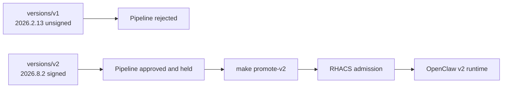

# Prepared supply-chain act: two decisions, one live promotion

The repository contains two compact release inputs. `versions/v1` pins
`openclaw@2026.2.13`; `versions/v2` pins `openclaw@2026.8.2`. Setup completes
both pipelines before the audience arrives. The presenter compares their
evidence and promotes the already-approved `openclaw:v2` release with one
command. The promotion resolves the tag to its signed immutable digest.

## What the audience should remember

- The same image recipe can produce different supply-chain decisions.
- RHACS evaluates the component found in the built image, not a demo label.
- The first run is rejected because the image contains `openclaw@2026.2.13`.
- The prepared v2 image contains `openclaw@2026.8.2` and the
  component-version policy passes.
- Cosign identifies the approved producer and immutable digest. It does not
  claim that the software is vulnerability-free.
- The pipeline SBOM is generated from the final image and attached to the same
  digest before promotion.

## Presenter path

1. Open the running v1 workload and its two RHACS findings.
2. Compare the retained failed-v1 and successful-v2 PipelineRuns.
3. Show the v2 final-image SBOM, signature, RHACS image check, TPA bundle, and deployment check.
4. Run `make promote-v2`.
5. Show RHACS admission accepting the signed maintained digest.
6. Open OpenClaw v2 and continue with the runtime email act.

Both custom policies are Critical because they encode release-blocking
organizational decisions. Their criteria remain narrow: the affected OpenClaw
component version and absence of the approved signature.

This act detects and blocks a risky component. It does not reproduce an RCE.
