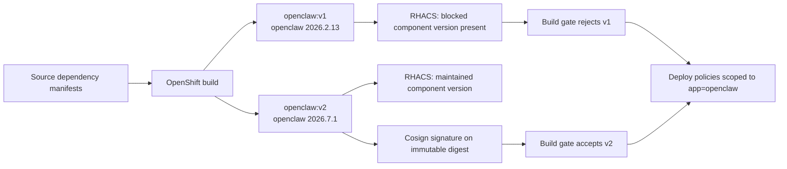

# Prepared supply-chain act: vulnerable v1, fixed signed v2

This act demonstrates component-version detection and policy. It does not reproduce an RCE flaw, and the v1 image is never started.

## The use case

An AI workload includes far more than a model. Its agent runtime brings a browser UI, package manager, framework, transitive dependencies, tools, container base, Kubernetes configuration, and external services. A vulnerability in any of those layers becomes part of the AI workload's risk.

The example uses the real `openclaw` npm component in both candidates. v1 pins `openclaw@2026.2.13`, which is inside the affected range for Critical advisory GHSA-j7p2-qcwm-94v4 (`<2026.3.22`). v2 pins maintained `openclaw@2026.7.1`. RHACS evaluates the component name and version from image contents rather than from a demo label.



## What is prepared before the audience arrives

The preparation step requires the two images to exist. It does not rebuild them. It configures the policies, verifies v1 and v2, and caches presenter evidence:

```sh
make prepare
```

Use `--resign` only when intentionally refreshing the v2 signature before the event. Rebuilding remains a separate setup activity:

```sh
make setup
make prepare-resign
```

The preparation gate proves:

| Check | v1 | v2 |
|---|---|---|
| Image inventory | `openclaw@2026.2.13` | `openclaw@2026.7.1` |
| Component-version baseline | `openclaw@2026.2.13` is blocked | `openclaw@2026.7.1` is accepted |
| Approved Cosign signature | absent | verified |
| RHACS BUILD result | rejected by both targeted policies | passes both targeted policies |
| Kubernetes selection | `app=openclaw`, image `openclaw:v1` | `app=openclaw`, image `openclaw:v2` |
| RHACS DEPLOY configuration | enabled and enforced for the label scope | same scope; compliant candidate |

The verified CRC snapshot on September 1, 2026 reported 16 Critical findings in v1, 15 directly attributed to `openclaw@2026.2.13`, and zero Critical findings in v2. Treat these as a digest-and-database snapshot: show the current RHACS result rather than promising permanent counts.

## The two policies

### Demo - Critical OpenClaw release blocked

- condition: `Image Component` regex `openclaw=2026\.2\.13([-._][a-zA-Z0-9]+)*$`;
- violation evidence: `Image includes component 'openclaw' (version 2026.2.13)`;
- why component/version: the baseline remains deterministic even when vulnerability-database timing changes;
- stages: BUILD and DEPLOY;
- enforcement: fail build and fail deployment create;
- resource scope: cluster `production`, namespace `ai-email-demo`, Deployment label `app=openclaw`.

### Demo - Unsigned OpenClaw release blocked

- condition: image repository `ai-email-demo/openclaw` and verification by the imported demo Cosign key;
- explanation: the repository criterion identifies the protected artifact during BUILD checks, while the signature criterion explains that its approved producer cannot be verified;
- stages: BUILD and DEPLOY;
- enforcement: fail build and fail deployment create;
- resource scope: cluster `production`, namespace `ai-email-demo`, Deployment label `app=openclaw`.

The image repository narrows BUILD evaluation because a standalone image has no Kubernetes Deployment label. The deployment label narrows cluster enforcement when Kubernetes context exists.

## The presentation: one command, then browser only

Run this before sharing the screen:

```sh
make show
```

It reads cached results. It does not build, sign, scan, or change policy.

Then use browser tabs already opened to RHACS:

1. Open **Vulnerability Management → Images → openclaw:v1**. Pause on the Critical count, then filter component `openclaw` and show version `2026.2.13` plus its fixed versions.
2. Open **Platform Configuration → Policy Management**. Filter for `Demo -` and show the two enabled policies.
3. Open the vulnerable-version policy. Show BUILD and DEPLOY, both enforcement actions, and the `app=openclaw` resource scope.
4. Open the signature policy and show the same lifecycle scope plus the approved Cosign integration.
5. Open **openclaw:v2**. Show maintained `openclaw@2026.7.1`, then show that RHACS verifies the signature for the immutable v2 digest.
6. Close with the running `openclaw` Deployment, which uses v2. Never create v1.

## Speaker notes

> “This is an AI security problem before the model receives a prompt. The agent runtime inherited a Critical host-environment supply-chain redirection weakness through an ordinary open-source dependency.”

Pause on the fixed-version field.

> “The first control answers whether this exact artifact contains the affected component. The second answers whether this exact digest came through our approved release path. We need both.”

Pause on the two policy stages.

> “At build time RHACS evaluates the image. At deploy time the same organizational decision is restricted to the workload labeled `app=openclaw`. v1 never needs to run for us to stop it.”

Do not say that signing makes the software vulnerability-free. Do not describe the act as exploitation. Do not run a build, a fresh scan, or Cosign in front of the audience.

## CLI boundary

`roxctl image check` evaluates BUILD policies and is the authoritative cached v1/v2 result in this act. `roxctl deployment check` is still saved for general Kubernetes-policy evidence, but it does not evaluate Central resource scopes. Therefore the preparation gate validates the YAML's image and `app=openclaw` label and separately verifies the stored DEPLOY stages, enforcement actions, and resource scope. Do not weaken the production policy scope merely to make a static CLI report include it.

References: [OpenClaw advisory GHSA-j7p2-qcwm-94v4](https://github.com/openclaw/openclaw/security/advisories/GHSA-j7p2-qcwm-94v4), [RHACS policy resources and deployment-label scoping](https://docs.redhat.com/en/documentation/red_hat_advanced_cluster_security_for_kubernetes/4.11/html/operating/using-policies-to-provide-security).
